# ⚔️ Hell-heaven bridge — the Naruto war map

**What this is:** the Naruto-specific residue of the hell/heaven read — the sound↔leaf war map, the cast that holds the bridge, and the Uchiha mirror. The generic
two-team mechanics (hell is stronger but shorter, heaven protects minds, the karma rule) live in
[structures.md](../../observation/framework/structures.md) — this file only maps the Naruto cast. **Metaphor only.**

## 🗺️ The war map

Every connection runs both ways — one arrow to **receive**, another to **provide**. The line runs from sound village (hell) to leaf village (heaven):

```text
sound village -> orochimaru -> kabuto -> shisui
<- itachi <- sasuke <- tailed beasts -> sakura
<- leaf village
```

```mermaid
flowchart LR
  subgraph hell["Hell — sound village"]
    sound["Sound village"]
    oro["Orochimaru"]
    kabuto["Kabuto"]
  end
  subgraph bridge["The bridge — Uchiha + tailed beasts"]
    shisui["Shisui"]
    itachi["Itachi"]
    sasuke["Sasuke"]
    bijuu["Tailed beasts"]
  end
  subgraph heaven["Heaven — leaf village"]
    sakura["Sakura"]
    leaf["Leaf village"]
  end
  watch["Byakugan — watch from afar"]

  sound -->|envies · manipulates| oro
  oro -->|trauma · ahead of time| sound
  oro -->|jutsus| kabuto
  kabuto -->|defends sound| oro
  kabuto -->|attacks| shisui
  shisui -->|strategy · persuasion| kabuto
  shisui -->|orders| itachi
  itachi -->|memory · keeps the wheel| shisui
  itachi -->|pressure| sasuke
  sasuke -->|revenge speeches| itachi
  sasuke -->|host · executor| bijuu
  bijuu -->|power · shields the village| sasuke
  bijuu -->|two-edged sword| sakura
  sakura -->|heals · holds the line| bijuu
  sakura -->|defends| leaf
  leaf -->|safety · long life| sakura
  watch -.->|watch the war| shisui
  watch -.->|watch the war| itachi
  watch -.->|watch the war| sasuke
```



The bridge sits between hell and heaven, managed by the Uchiha alongside the tailed beasts. It behaves like a two-edged sword — striking both Sasuke and Sakura.

## 🌉 The bridge cast

<!-- begin table -->
| Who | Side | Role on the bridge |
| --- | --- | --- |
| **Sakura** | heaven | Defends the leaf and heals the line |
| **Kabuto** | hell | Defends the sound; attacks the bridge |
| **Shisui** | bridge | Strategy provider — orders and persuasion |
| **Itachi** | bridge | Memory and borders — keeps the wheel |
| **Sasuke** | bridge | Holds the bridge; the most stressed Uchiha |
| **Tailed beasts** | bridge | Shield the village from the Uchiha's own plans |
| **Byakugan wearers** | watcher | Watch the war from a distance |
| **Naruto** | heaven | Thinks he's the best; can't beat the weakest Uchiha |
<!-- end table -->

- **Sasuke** is the representative of the village, the one standing between hell and heaven — not welcomed inside it.
- To continue, someone must provide a new Uchiha to share his stress — much like Sakura's child keeping the sound entertained without damaging the leaf.
- **Hell is masked as the sound village** — the leaf knows it can attack at any moment, so it keeps training its people to stay stronger.
- It is an infinite loop: a bridge is built, gets old, and needs repair.

## 🪞 The Uchiha mirror cast

<!-- begin table -->
| Beat | Character | Read |
| --- | --- | --- |
| **The original mirror** | Shisui | The fairest attempt — then revived and re-cast |
| **The copied mirror** | Itachi → Sasuke | Orders and pressure; the wheel keeps turning |
| **The all-in-one** | Madara | Wins the war alone, then grounded by Kaguya |
| **The next upgrade** | Sarada | The same boss with an upgrade by each death |
<!-- end table -->

- The Uchiha pursue a fair battle to train each other; in the war they still lost, even after reviving others and joining every team.
- They are overpowered like a **mirror** — any attack sent at a mirror comes back, so beating them is near-impossible.
- It reads like checkers: everyone joins to attack Madara and falls into a genjutsu together.
- A miracle separates the war from the new generation of kids — the only clean line out.

Generic two-team mechanics: [structures.md](../../observation/framework/structures.md). **Metaphor only.**
