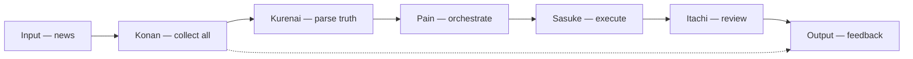

# 🎼 Orchestrator — the Naruto cast map

**What this is:** the Naruto-specific residue of the orchestrator read — who sits at the center and who plays each role, plus the mission-map pipeline. The generic
theory (the center that sees both ends, news versus truth-parse, data states) lives in [monitoring.md](../../observation/monitoring.md),
[ledgers.md](../../observation/society/ledgers.md), and [evidence.md](../../observation/justice/evidence.md) — this file only names the Naruto cast. **Metaphor only.**

## 🎼 The cast map

<!-- begin table -->
| Role | Character | Naruto read |
| --- | --- | --- |
| **Center / orchestrator** | Pain / Nagato | Sees both ends of the line; holds the deck and accumulates into Gedo |
| **Collector** | Konan | Receives all news — no single data point lost |
| **Truth-parser** | Kurenai | Flags odd facts; free to evaluate while Konan is busy |
| **Investigator** | Shisui | Finds the responsible when proof is missing |
| **Executor** | Sasuke | Goes after the target |
| **Reviewer** | Itachi | Reviews results and defines the borders |
| **Wheel / continuity** | Naruto | The odd piece that keeps the wheel spinning |
<!-- end table -->

The team around the center: **Itachi** (borders — close, defensive, counseling), **Sasuke** (attack — pressure that keeps Itachi reasonable), and **Naruto** (wheel). A
small team is strong, which makes it a target; removing the leader loses control.

## 🗺️ Mission map

Being aware of the **input**, the **processing**, and the **output**.

## 🎭 The vengeance theater cast

<!-- begin table -->
| Step | Role | Character |
| --- | --- | --- |
| Receives news | news receiver | Kurenai |
| Investigates the responsible | investigation | Shisui |
| Orchestrates the theater | director | Pain |
| Goes after the target | execution | Sasuke |
| Reviews the results | reviewer | Itachi |
| Receives feedback | feedback provider | Konan |
<!-- end table -->

Pain holds the deck of cards and keeps accumulating into Gedo; the rest of the village is the theater that keeps order.

Generic orchestrator, news-truth, and data-state theory: [monitoring.md](../../observation/monitoring.md),
[ledgers.md](../../observation/society/ledgers.md), and [evidence.md](../../observation/justice/evidence.md). **Metaphor only.**
