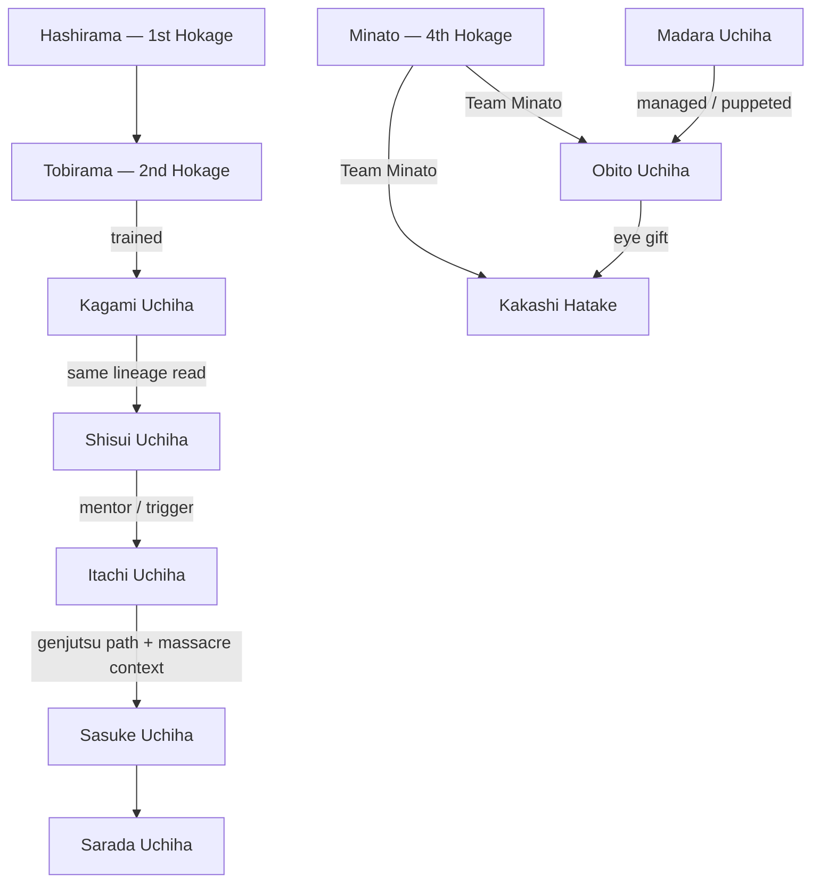
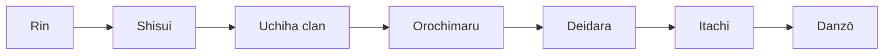

# 🌀 Sharingan Mangekyo

**What this is:** the Sharingan deep dive — Mangekyō lines, mentorship chain, timeline, ability ranking, and death reports.

Uchiha bloodline — perception, copy, genjutsu. **Personal read** mixed with canon beats; rank column is your ladder, not official power scaling.

**Merged read:** Mastery axis — internal lottery vs Tobirama–Kagami mentorship line.

## 🌿 Two Uchiha lines

<!-- begin table -->
| Line | Anchor | Tone |
| --- | --- | --- |
| **Tobirama → Kagami → Shisui → Itachi** | 2nd Hokage's student chain | Village loyalty, persuasion over massacre |
| **Main clan / Madara pole** | Fugaku, Obito thread, civil-war Uchiha | Chaotic, coup energy, tied to Senju feud |
<!-- end table -->

**Read:** Shisui sits with **Tobirama's world** (speed, seals, rational village) — not Madara's revival obsession. Still entangled with **Danzō** and **3rd Hokage** era politics because Konoha
absorbed the clan.

**Tobirama (2nd Hokage):** probably **strongest active shinobi in the village after Hashirama** — lost only to the 1st. Creator of Flying Thunder God, Edo Tensei, many water styles; anti-Uchiha policy
yet trained **Kagami**, who stayed loyal.

---

## 🔗 Mentorship chain

<!-- begin table -->
| Link | What passed |
| --- | --- |
| **Tobirama → Kagami** | Loyal Uchiha inside Tobirama's Konoha — proof clan ≠ monolith |
| **Kagami → Shisui** | **Mentorship read** — discipline, village-first, genjutsu prestige |
| **Minato → Obito / Kakashi** | **4th Hokage** led **Team Minato** — speed + mission discipline; **Rin** as shared bond |
| **Madara → Obito** | **Managed** him post-crush — war architect from the shadows |
| **Obito → Kakashi** | **Sharingan transplant** after crush; same **Rin death** unlocks both Mangekyō (**Kamui**) |
| **Shisui → Itachi** | Best-friend bond; eye legacy; **Kotoamatsukami** trust |
| **Itachi → Sasuke** | Tsukuyomi loops; staged hatred; **lonely pursuit** of Itachi |
<!-- end table -->

**Chaotic branch:** rest of Uchiha compound — coup planning, Fugaku as chief, police tension. Itachi and Sasuke **looked fine** until Shisui's death + Itachi's **trigger** (memory / hatred
engineering) pushed Sasuke into **isolation and revenge chase**.

---

## 📅 Mangekyō timeline

<!-- begin table -->
| User | Sharingan first | Mangekyō unlock *(event)* | Signature Mangekyō | Notes |
| --- | --- | --- | --- | --- |
| **Madara** | Early youth | Brother **Izuna** dies (canon) | Susano'o, genjutsu, Rinnegan later | Rank **#1**; **managed Obito** |
| **Kagami** | Unknown | Unknown — **no confirmed Mangekyō** | — | Loyal student of Tobirama; lineage symbol |
| **Obito** | Gift / trauma | **Rin dies** | **Kamui** | Rank **#2**; **Minato** squad; **Madara** managed him after |
| **Shisui** | Early prodigy | **Friend dies** in war (flashback) | **Kotoamatsukami** — mass persuasion | Rank **#3**; suicide to stop Danzo |
| **Itachi** | Early prodigy | **Shisui dies** (witness / eye handoff) | **Tsukuyomi** — reality emulation, long duration | Rank **#4**; could fall to Shisui's genjutsu |
| **Sasuke** | Part I — hatred | **Itachi dies** (duel) | **Amaterasu** + Susanoo; **better flame control** than Itachi | Rank **#5**; plugs Itachi's eyes → EMS |
| **Kakashi** | Transplanted (Obito's eye) | **Rin dies** (through Obito's eye) | **Kamui** | Rank **#6** — borrowed eye, same jutsu weaker read |
| **Sarada** | Boruto — meets Sasuke | *(Mangekyō later in Boruto era)* | TBD — awakening still young | Rank **#7**; see [Sarada](#%EF%B8%8F-sarada) |
<!-- end table -->

**Ordinary Sharingan ladder:** 1-tomoe (stress) → 2-tomoe (combat) → 3-tomoe (full copy/predict) → Mangekyō (trauma) → EMS ( sibling / transplant eyes).

---

## 🏆 Ability ranking (personal)

Mangekyō **persuasion / space** lane — not raw taijutsu.

<!-- begin table -->
| Rank | User | Power | Read |
| --- | --- | --- | --- |
| **1** | **Madara** | Susanoo / Rinnegan / Limbo | Apex — **managed Obito** from the shadows |
| **2** | **Obito** | **Kamui** (+ Rinnegan later) | Space warp; **Madara's pawn** who still outranks the village persuasion line |
| **3** | **Shisui** | **Kotoamatsukami** | “Convince anyone” — even Itachi would lose if Shisui committed |
| **4** | **Itachi** | **Tsukuyomi** | Emulated reality; **unlimited duration** inside target's head |
| **5** | **Sasuke** | **Amaterasu** (+ Susanoo) | Same **black flames** as Itachi but **better control**; destruction over subtle rewrite |
| **6** | **Kakashi** | **Kamui** (one eye) | Same technique as Obito — **borrowed sight**, not Uchiha body |
| **7** | **Sarada** | TBD *(Boruto era)* | Too early to judge — **lowest rung** until Mangekyō proves otherwise |
<!-- end table -->

**Shared motif:** top persuaders **rewrite what the victim accepts as real** — Shisui edits will, Itachi edits time, Obito edits **space**, Sasuke edits the battlefield with fire.

---

## 🪦 Death reports & Sharingan tricks

**Cascade read** — each loss feeds the next Uchiha trauma layer:

### 🌀 Rin → Itachi → Danzō chain

<!-- begin table -->
| # | Reported death | Who claims | Doubt read |
| --- | --- | --- | --- |
| 1 | **Rin** | Kakashi's **chidori** (canon) — Kiri plot / **Three-Tails** jinchūriki trap | **Obito watched** through transplanted eye — same moment unlocks **Kamui** for Obito + Kakashi |
| (cont.) | | | grief may be **engineered** |
| 2 | **Shisui** | Suicide off cliff; Danzō took one eye | Only Shisui / Itachi knew — **no independent confirm**; may have **genjutsu'd Itachi** · [dossier](shisui-uchiha.md) |
| 3 | **Uchiha clan** | Itachi **massacred** compound — **Fugaku**, **Mikoto**, police, coup planners | Official story; **only Itachi + Tobi (Obito)** on scene — Sasuke **not** a witness; bodies = **closed case** |
| 4 | **Orochimaru** | Sasuke absorbed / “killed” | Orochimaru **returns** — classic Sharingan-layer **deception** |
| 5 | **Deidara** | Sasuke victory | Explosion / C4 **misread** — Sasuke's **Mangekyō** snake summon escape muddies confirm |
| 6 | **Itachi** | Sasuke “killed” him | Itachi **planned** the outcome; body + memory may be **staged** |
| 7 | **Danzō** | Sasuke kills after Summit | Danzō's arm of **stolen Sharingan** + **Izanagi** — **genjutsu death games**; held **Shisui's eye** |
<!-- end table -->

**Also Uchiha-adjacent** *(same unreliable-death bucket, outside main chain):*

<!-- begin table -->
| Reported death | Tie to Uchiha | Doubt read |
| --- | --- | --- |
| **Izuna** | Madara's brother — **eyes passed** for EMS | Consensual handoff in canon; still **close-kin eye theft** template |
| **Obito** | “Crushed” at **Kanabi Bridge** | **Alive** — **Madara** managed him; faked death **predates** Shisui arc by years |
| **Madara** | Valley of the End vs Hashirama | **Multiple** reported ends — Edo, betrayal, **still not done** until war arc |
| **Fugaku / Mikoto** | Clan heads — inside **massacre** | Itachi's **staged cruelty** toward Sasuke vs parents' **quiet acceptance** (canon flashback) |
| **Minato** | **Nine-Tails** night — **Obito** unleashed Kyūbi | Not Uchiha body — but **Obito thread** kills the **4th Hokage** who trained Obito/Kakashi |
<!-- end table -->

**Not in chain but worth flagging:** **Kagami** (lineage ghost — no death trick on record), **Hiruzen** (ordered the massacre **space**; died later to Orochimaru — village guilt, not Sharingan trick).

**Theme:** Sharingan lineage treats **witnessed death** as unreliable — genjutsu, body substitution, staged duels. Sasuke's arc **believes** he closed accounts (Orochimaru, Deidara, Danzō); audience
keeps finding **tricks**.

**Shisui → Sasuke lonely life:** Shisui's death + Itachi's **trigger** (Tsukuyomi memory / hatred seed) traps Sasuke in **solo revenge** until Itachi falls — only then the truth opens; **EMS** by
transplanting Itachi's eyes = literal **inheritance of sight**.

---

## 👁️ Sarada

<!-- begin table -->
| Stage | Event | Read |
| --- | --- | --- |
| **Sharingan** | Excitement / emotion meeting **Sasuke** (Boruto) | Classic Uchiha — **strong feeling** unlocks tomoe |
| **Progression** | Chūnin exam / team 7 next gen | Grind + lineage; not lottery-free |
| **Mangekyō** | Boruto-era trauma *(canon ongoing)* | Too early for full power read — **rank #7** until proven |
| **Rank read** | **#7** on Mangekyō ladder | Below **Kakashi** until awakening matures |
<!-- end table -->

**Read:** Sarada inherits **both** Sasuke's isolation scar and Sakura's discipline — possible **first stable Uchiha** without village-coup baggage if writers allow.

---

## 🔪 Psycho ladder & eye theft

<!-- begin table -->
| Rank | User | Pattern |
| --- | --- | --- |
| **1** | **Madara** | **Instant** extreme choices — **kill / harvest eyes** from **closest** (Izuna) |
| (cont.) | | six **Pain-style puppets** only **Sasuke** could see |
| **2** | **Sasuke** | Same **eye inheritance** instinct — plugs **Itachi's eyes** for EMS — but **slow**, **trial-and-error** |
| (cont.) | | needs **sad-memory triggers** for revenge mode |
| — | **Itachi** | Opposite pole — **rules**, **precision**, **fastest jutsu read/copy** in persuasion line; not impulsive |
| — | **Shisui** | **Sentimental**, **conflict-averse** — edits reality quietly instead of grabbing eyes |
<!-- end table -->

**Temperament fork:** Tobirama line (Shisui → Itachi) = **village chess**; Madara pole (Madara → Sasuke rhyme) = **trauma acceleration** and **literal sight theft**.

---

## 🌀 Madara & reincarnation read

<!-- begin table -->
| Claim | Personal read |
| --- | --- |
| **Sasuke ≈ Madara reincarnation** | Same **solo obsession** pole — weakest Uchiha **chakra volume** in some scales |
| (cont.) | still awakens top-tier eyes through **trauma stack** |
| **Six puppets** | Madara **boasted Pain-like bodies**; battlefield read = **only Sasuke's eye tier** tracked them |
| (cont.) | Limbo / genjutsu layer, not crowd knowledge |
| **Shisui unrelated to Madara** | Shisui ↔ **Tobirama / Kagami / Hiruzen / Danzo** orbit, not Izuna's line |
| **Shisui → Itachi sabotage** | Endgame doubt: Shisui's **genjutsu** may have made Itachi **believe** a death **not independently confirmed** |
| (cont.) | twists massacre motive |
| **Mangekyō rarity (pre-war)** | Full ladder **#1 Madara** → **#2 Obito** → **#3 Shisui** → **#4 Itachi** → **#5 Sasuke** → **#6 Kakashi** → **#7 Sarada** |
<!-- end table -->

**Counter:** Official story adds Obito, Kakashi, EMS crowd — your table is **village persuasion lineage**, not every awakened eye in the war.

---

## 📉 Generational violence read

<!-- begin table -->
| Era | Scale | Tone |
| --- | --- | --- |
| **Founders** (Madara vs Hashirama) | **Giant summons**, full **bijuu** chess, valley carving | Violence as **default diplomacy** |
| **Naruto generation** | War arc still **nuclear** — but **younger cast** fights more **competitive** than **genocidal** day-to-day | Violence as **sport + rivalry** |
| **Boruto** | No more **giant** brawls or **bijuu** arms race on screen — **elders' peace** as background | Peace as **status quo** |
<!-- end table -->

**Loop:** Survivors who **won the last war** age out — too **old** to carry the next crisis when **living youth** complain and **restart** conflict. Peace is **pause**, not solve — rhymes with
questions § Cycle.

---
