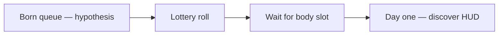

# 👶 Born — spawn kit and expectations

**What this is:** what the lottery hands you **at day one**—IV baseline, EQ seed, family vs orphanage, and what managers **expect** before you have EVs. How to **play the hand** after spawn:
[play.md](./play.md). After body stop: [restart.md](./restart.md). Places on the board: [structures.md](./structures.md).

**Closest game read:** **The Sims** spawn—lot, needs, aspiration seed. **Metaphor only.**

---

## 🎲 Lottery outputs (day one)

<!-- begin table -->
| Roll | Becomes |
| ------ | --------- |
| **Family vs orphanage vs later adoption** | First **manager** and daily rules |
| **Place / era / class** | Map difficulty, law, stigma |
| **IV baseline** | Health, looks, learning tilt—mostly **rolled** |
| **EQ seed** | How the first house trains trust, shame, affection |
<!-- end table -->

You land **tied to a family or orphanage**—first stats are **assigned**, not chosen.

Hypothesis queue detail: [restart.md § before life](./restart.md#-before-life--born-queue-and-lottery).

---

## 🧬 Accept spawn — IVs, EQ, and EVs

Pokémon handles, **car read** — game detail: Pokémon IVs/EVs.

<!-- begin table -->
| Stat | Name | Car read | Life read |
| --- | --- | --- | --- |
| **IV** | **Individual value** | **Model you were born with**—engine, frame, top speed, reliability | Health, looks, learning tilt, family map, money at spawn—**mostly rolled** |
| **EV** | **Effort value** | **Driving skill**—how well you **actually move** the car you got | Hours per domain: craft, fitness, social, money, repair—**what you trained** |
<!-- end table -->

<!-- begin table -->
| Handle | At birth | After living |
| -------- | ---------- | -------------- |
| **IV** | **Car model**—health, looks, learning tilt, money buffer | Mostly fixed; rare swaps ([possibilities.md](./possibilities.md)) |
| **EQ seed** | Relationship training from first managers | Hard to fully erase |
| **EV** | **Empty** | Filled by reps—work, health, social, craft |
<!-- end table -->

**IV is the car; EV is the driver.** Race results need **both**. A perfect line in a **beater** can still **lose** to a mediocre line in a **Ferrari**—that is the **unfairness** people mean when they
say life is rigged.

### 📌 Car swap — possible, uncommon

**Body and class swaps** happen—accident amputation, voluntary transition, forced mutilation—but **full IV reroll** is **rare**. Most of the run you **tune and drive what you spawned with**. See
[hard-limit § body can change shape](../fundamentals/hard-limit.md#-the-body-can-change-shape).

**Not Wonderland:** choosing transition is **patching the sheet you accept**, not pretending you rolled a different model.

### 📌 EV shows effort—and compensates for a weak IV

**EV is per lane:** high **work EV**, low **social EV**, medium **health EV**—skill bars for **each kind of road**.

- **What EV measures:** **reps** and **performance with what you have**.
- **High-EV underdog:** often grew up **behind**—always catching up, so they **had** to train. Skill is real; so is the **reason** it got high.
- **Counterfactual unfairness:** same driver with **better IV** would likely **place higher**—valid grief, not whining.

### 📌 Ferrari problem vs beater trap

<!-- begin table -->
| Spawn | Training pressure | Risk |
| --- | --- | --- |
| **Ferrari IV** (thick bubble, easy map) | **Low push to train**—“why grind when the car wins laps idle?” | **Rusty EV**; one patch change (job loss, illness, divorce) and you **cannot drive** |
| **Beater IV** (thin bubble, hard map) | **Always forced to train**—miss one maintenance week and **something breaks** | Burnout, bitterness, or **elite EV** from sheer mileage |
<!-- end table -->

**Not stimulated to train if you already have a Ferrari; always forced to train if you have a bad car.** Era meta that commoditized **horsepower** widens the Ferrari zone—more people **feel** they
should not need EV—until the patch shifts. Era read: [play § dream and meta](./play.md#-life-dream-and-rat-wheel).

### 📌 EQ — early driving school

**EQ** is what **family and culture install before you choose routes**—the **instructor voice** when you first touch the wheel. Not IV or EV; **starting firmware** from your first garage.

<!-- begin table -->
| Layer | Handle | One line |
| --- | --- | --- |
| **IV** | Car model | What you **spawned with** |
| **EQ** | First instructors | How you were **taught to drive emotionally** |
| **EV** | Your mileage | What **you** logged on each road |
<!-- end table -->

**Acceptance ≠ resignation.** Stop pretending you rolled a **different model**; **max EV on your actual car** is still the game.

**Compare fairly:** peers with **similar IV class** and **similar era meta**—not a trust-fund influencer whose **Ferrari + free mechanic** you never had.

### 📌 Build tiers (illustrative)

<!-- begin table -->
| Tier | Sketch |
| ------ | -------- |
| **S-tier bubble** | Wealthy stable map, healthy, connected family |
| **Mid** | Average body, paycheck life, some support |
| **Hell-tier** | Violence, hunger, dignity stripped—map fights you by design |
<!-- end table -->

**Horrible roll ≠ zero agency.** Score is **context-adjusted** on your board—not vs a global leaderboard.

---

## 👨‍👩‍👧 Managers and expectations

<!-- begin table -->
| Placement | Manager read | Expectation |
| ----------- | -------------- | ------------- |
| **Family** | Parents / kin as first authority | Obey, learn, **eventually leave** or inherit role |
| **Orphanage** | Institution as manager | **Temporary**—society expects **graduation**, not permanent childhood |
| **Adoption** | New manager mid-run | Same arc—belong, then **independence** |
<!-- end table -->

**You do not pick day-one stats.** You **discover** them and play.

---

## 📌 What society expects early

- Learn **rules** (language, law, shame boundaries).
- Stay **alive** through dependency phase.
- **Exit** orphanage or family dependency when map allows—see [structures § path](./structures.md#%EF%B8%8F-alive-path--born-to-graveyard).
- Start filling **EVs**—school, chores, work, relationships.

## 🧭 How this connects
