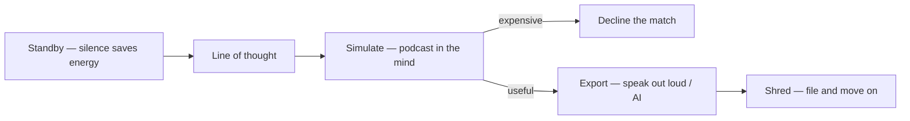

# 🧠 Intra thoughts — the mind's solo lane

**What this is:** keeping a **line of thought** running on your own — like a song or a podcast you don't need headphones for. The practice, the costs, and the ceiling of **thinking alone**. Pairs with
[fear-triage.md](../fundamentals/fear-triage.md) (when further thinking stops being useful) and [monitoring.md](../perception/monitoring.md) (the game frame it all runs inside). **Metaphor only.**

---

## 🔇 Silence is standby mode

Hard to stay in complete silence — it feels a bit like considering your heart will stop while you sleep. It doesn't. Silence is **standby mode**: lower power, saves energy, lets the system run
**cleanup**.

- **Not street running** — there the heart is fast and holding pace; effort. Standby is the opposite.
- **Uses:** focus on cleanup — sort one line of thought, file it or shred it, come back with more energy.

## 🏃 Thinking is training

Like running: thoughts are hard to control — you can't simply run faster than Bolt, you have to train for a while, and you may have an accident or simply a bad day.

<!-- begin table -->
| Factor | Read |
| --- | --- |
| **Training** | A line of thought sharpens with practice |
| **Bad days** | Runs fail — off-days happen |
| **Time away** | A break costs performance |
| **Context** | Pub drinking vs a disciplined student — the environment trains or degrades the loop |
<!-- end table -->

## 🚗 Driver beats car

Person-as-car is too simple. A bad driver in the best car loses to a great driver in a standard car. **Execution over equipment** — the same thoughts are handled well or poorly.

## 🎻 Orchestra and the podcast simulation

Some thought lines are complex — a strategy involving another person, comprehending a different point of view. Emulate a podcast inside your mind: say what you'd say, guess their response, replay the
exchange.

- **Funny but expensive** — playing ping pong inside your own mind.
- **Know when to decline the match** — the stop rule is [fear-triage § "is further thinking useful?"](../fundamentals/fear-triage.md#-is-further-thinking-useful--template).

## 🔒 Alone vs with others — the safety gradient

Crimes generally happen when **two alive people** interact. Alone, in a private environment, there's no crime — at worst you damage your own stuff or someone else's property, which money can fix.

<!-- begin table -->
| Situation | Risk | Repair |
| --- | --- | --- |
| **Alone, private** | Soft to none | Money pays for property |
| **Physical interaction** | Irreversible body harm — a limb is no-going-back | Not recoverable |
<!-- end table -->

- **Rule:** freedom while alone, carefulness around others. Unless a meteor falls from the sky, you're limited by your own health.
- **Freedom to think ≠ freedom of speech.** No crime in your own thoughts; people complain more about **hearing** problems.

## 🗑️ Shredding the note

Thinking alone is like writing a note and shredding it down the toilet — done for yourself, then discarded. Be your own psychologist; skip scheduling ceremonies with someone else for every topic.

## ⛰️ The ceiling — your own knowledge

Solo thought is bounded by your own knowledge. Another person may carry a different point of view.

- **Speaking out loud** clears paranoia — [sentiment.md](../perception/sentiment.md) · [monitoring.md](../perception/monitoring.md).
- **New outlet:** AI — an interlocutor without ceremony.

---

## 🧭 How this connects

<!-- begin table -->
| Topic | Hub |
| --- | --- |
| When thinking stops being useful | [fear-triage § "is further thinking useful?"](../fundamentals/fear-triage.md#-is-further-thinking-useful--template) |
| Paranoia and the monitored frame | [monitoring.md](../perception/monitoring.md) |
| Felt layer and verbalizing | [sentiment.md](../perception/sentiment.md) |
| The game frame | [structures.md](./structures.md) |
<!-- end table -->
