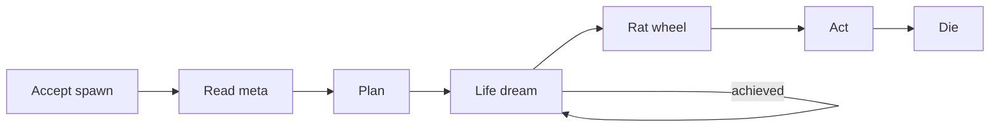
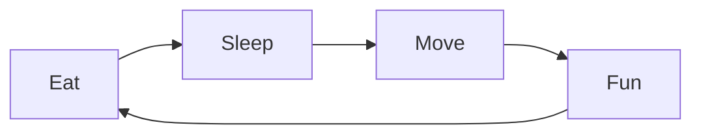
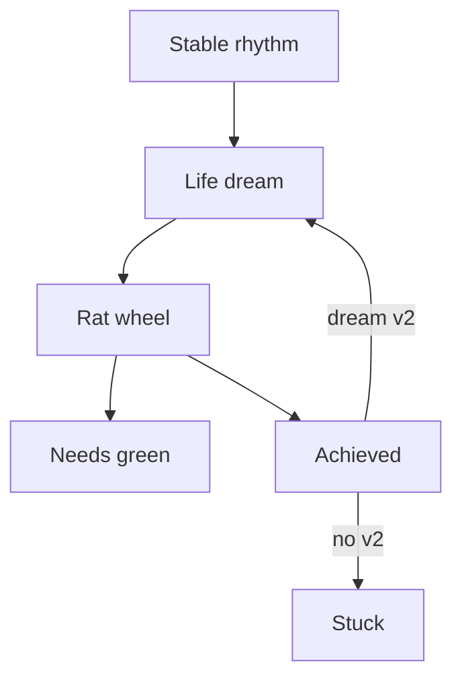
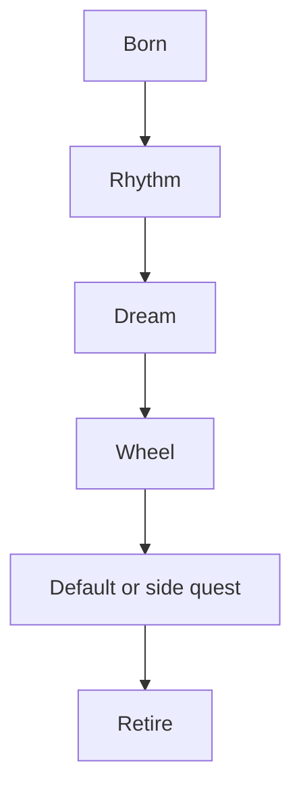

# 🎮 Play — run the day (Sims read)

**What this is:** everything about **executing while alive**—six-beat arc, needs, credits, dream, rat wheel, default course, work/bank, personal poles. State **changes** (money, health, class):
[possibilities.md](./possibilities.md). Groups and beliefs: [society.md](../society/society.md). Spawn: [born.md](./born.md).

**Closest game read:** **The Sims** (needs, aspiration, daily grind). **Metaphor only.**

---

## 🎬 Six-beat arc

You were **born as someone specific**—not a blank avatar.

<!-- begin table -->
| # | Beat | One line |
| --- | ------ | ---------- |
| 1 | **Accept build** | [born § IV/EQ/EV](./born.md#-accept-spawn--ivs-eq-and-evs) |
| 2 | **Read meta** | What this **patch** rewards |
| 3 | **Plan** | Best moves while **credits** last |
| 4 | **Life dream** | Carrot that survives bad seasons |
| 5 | **Routine** | Rat wheel that keeps needs green |
| 6 | **Die** | Chapter closes → [restart.md](./restart.md) |
<!-- end table -->

**Win condition:** **sustainable happiness with balance**—win **your board**, not the whole server.

---

## ⚠️ Needs — fail these, nothing else renders

<!-- begin table -->
| Need | If neglected |
| ------ | ---------------- |
| **Eat** | Energy collapse, health tax |
| **Sleep** | Judgment drift, illness |
| **Move** | Body debt, mood crash |
| **Fun** | Burnout → [society § sabotage](./../society/society.md#-sabotagers) |
| **Social** | Isolation or drama tax |
<!-- end table -->

**Daily checkpoint:** **wake** → spend credits → **sleep** (soft save) → repeat until permanent death.

Plan habits: routine · execution: priority · governance.

---

## 💳 Credits — spend bar

Every day burns **health, time, focus**. While credits remain:

<!-- begin table -->
| Lever | Role |
| ------- | ------ |
| **Plan** | Next 3–5 **reachable** moves on your HUD |
| **Life dream** | Long carrot (Sims **want bar**) |
| **Routine** | Repeatable loop; without it, needs and money decay |
| **Meta speed** | Grasp patch rewards early → fewer wasted seasons |
<!-- end table -->

---

## 🎡 Life dream and rat wheel

**Aspiration:** one **story you keep** (house, craft, freedom number, “be the parent I didn’t get”) that **reorders** the queue after bad years—not erased by one bad boss or diagnosis.

<!-- begin table -->
| State | Read |
| ------- | ------ |
| **Active** | Wheel has direction |
| **Achieved** | Install **dream v2** or hit “what now?” |
| **No v2** | Stuck UI—comfort without pull |
<!-- end table -->

**Good enough carrot:** skipping tomorrow’s spin feels **worse** than showing up. No carrot → jelly ([society § groups](./../society/society.md#%EF%B8%8F-belief-groups-shared-opinions)); no wheel →
[Wonderland](./../society/society.md#-wonderland--solo-delusion).

**Rat wheel:** gym, job, inbox, date night—**repetition keeps the Sim alive**. Boredom → wrong routine, stale dream, or vague carrot—patch one.

**Era meta (rough):** brains prized → AI commoditized **horsepower** → **face + vibe** patch. Funko shelf — funko album. Speed vs brains as [personal poles](#-personal-poles-middles) below.

---

## 🗺️ Default course vs side quest

**Prefab script:** earn → pair → parent (~20y, no undo) → teach → retire. Loud because it eases **comparison** and respawn.

<!-- begin table -->
| Stage | Tax |
| ------- | ----- |
| Earn | Status competition — sentiments around loss/win: [society § competition path](./../society/society.md#-competition-path-how-sentiments-spun-up) |
| Pair | Relationship bandwidth — mask vs upfront attention: masks § attention |
| Parent | ~20 years |
| Teach | Narrative transfer |
| Exit | Retire |
<!-- end table -->

**Opt out** (art, craft, no kids, nomad)—valid; often **harder**. Institutions: [structures.md](./structures.md).

---

## 💼 Work and bank

Income (company, farm, gig) + **bank** (credit/debit) feed the wheel. Detail: [structures § catalog](./structures.md#-structure-catalog). **Money tier moves:**
[possibilities § money](./possibilities.md#-money).

---

## 🧭 Personal poles middles

Paired tensions with a **middle** quality (not “zero”). **Resource** pole (rich/poor) lives in [possibilities](./possibilities.md)—numbers on hud.md.

<!-- begin table -->
| Axis | Poles | Middle |
| ------ | ------- | -------- |
| **Mood** | Euphoria-chasing ↔ numb collapse | **Sustainable satisfaction** |
| **Risk** | Panic ↔ reckless bravado | **Calm agency** |
| **Tempo** | Speed ↔ brains | **Paced craft** |
<!-- end table -->

After harm between people: [society § fix/justice/vengeance](./../society/society.md#%EF%B8%8F-fix-justice-vengeance).

---

## ⚡ One outward step (after spin-down)

When anxiety or loops block function, run [fear-triage § boot essence](../fundamentals/fear-triage.md#-boot-essence--acute-spin-up) first. Then pick **one** smallest physical action:

<!-- begin table -->
| Tier | Examples |
| --- | --- |
| **Micro** | Dish, trash, one email, stand outside |
| **Social** | One safe text or call—shallow is fine |
| **Task** | One row from the task board |
| **Meaning** | One line from [life dream](#-life-dream-and-rat-wheel), then act |
<!-- end table -->

Boot is done when one next action is in motion.

---

## 💥 When the board breaks

<!-- begin table -->
| Break | Route |
| ------- | -------- |
| Disease / injury | [structures § health](./structures.md#-health-lane-on-the-map) |
| Money collapse | [possibilities § money](./possibilities.md#-money) |
| Forced harm | [harm.md](../fundamentals/harm.md) |
| Spin-up / anxiety loop | [fear-triage § boot](../fundamentals/fear-triage.md#-boot-essence--acute-spin-up) |
<!-- end table -->

## 🧭 How this connects
