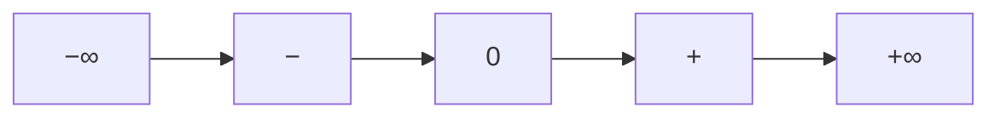

# 🔀 Possibilities — changes and how to achieve them

**What this is:** **state transitions** on your HUD—what can move **forward**, **backward**, or **laterally**, and **which approaches** usually work. Daily execution: [play.md](./play.md). Spawn:
[born.md](./born.md). Places: [structures.md](./structures.md).

**Not every transition is legal on every map**—law, biology, cost, and [society § groups](./../society/society.md#%EF%B8%8F-belief-groups-shared-opinions) block some paths.

---

## 📊 Pole scale (all axes)

<!-- begin table -->
| Step | Label | Sketch |
| ------ | ------- | -------- |
| **−∞** | Infinite bad | e.g. **financially dead**—debit &gt; any plausible income |
| **−** | Bad | Bleeding, trapped, chronic |
| **0** | Neutral | Equilibrium |
| **+** | Good | Surplus, options |
| **+∞** | Infinite good | e.g. spend &lt; profit **forever** (rare) |
<!-- end table -->

**Personal mood poles** (happy/sad, fear/courage, speed/brains)—middles only, not tier ladders: [play § personal poles](./play.md#-personal-poles-middles).

---

## 💰 Money

**Species-scale:** where **cash / credit** came from (make → trade → compare) and what likely **stays** when labels change—[futures §
exchange](./../society/futures.md#-exchange-path-from-making-to-comparing) · [futures § sources](./../society/futures.md#-sources-nicknames-and-who-organizes).

### 🔄 Transitions (money)

<!-- begin table -->
| From → To | Direction |
| ----------- | ----------- |
| Poor → neutral | Forward |
| Neutral → rich | Forward |
| Rich → poor | Backward |
| Poor → −∞ debit | Backward (edge) |
| Rich → +∞ wealth | Forward (edge) |
<!-- end table -->

### 🛠️ How to achieve (compare approaches)

<!-- begin table -->
| Goal | Approach | Speed | Risk | Notes |
| ------ | ---------- | ------- | ------ | ------- |
| Poor → neutral | **Wage job** + spending cap | Medium | Low | Needs [structures § catalog](./structures.md#-structure-catalog), bank |
| Poor → neutral | **Trade / craft** EV grind | Slow | Medium | High [born](./born.md) IV tilt helps |
| Poor → neutral | **Education → credential** | Slow | Low | Upfront cost |
| Poor → neutral | **Partnership** (map-dependent) | Fast | High | Social and legal lock-in |
| Poor → neutral | **Geographic move** | Variable | High | New patch meta |
| Neutral → rich | **Business ownership** | Slow | High | Compound if survives |
| Neutral → rich | **Equity / assets** | Medium | High | Market and timing |
| Neutral → rich | **Executive climb** | Slow | Medium | Politics inside company |
| Rich → poor | **Health bill / lawsuit** | Fast | — | Common backward shock |
| Rich → poor | **Addiction / bad bet** | Fast | — | Self-inflicted lane |
| Rich → poor | **War / seizure / fraud victim** | Fast | — | External |
| → −∞ debit | **Predatory credit**, unbounded liability | Fast | Terminal | [play § breaks](./play.md#-when-the-board-breaks) |
| → +∞ wealth | **Profit &gt; spend forever** | Rare | Low if real | Trust + discipline or monopoly |
<!-- end table -->

**Backward traps:** sabotage, disaster—[harm.md](../fundamentals/harm.md). **Ledger:** [harm § the loop](../fundamentals/harm.md#-the-loop--assess--post--reconcile).

---

## ❤️ Health

### 🔄 Transitions (health)

<!-- begin table -->
| From → To | Direction |
| ----------- | ----------- |
| Healthy → sick | Backward |
| Sick → healthy | Forward |
| Sick → graveyard | Terminal |
<!-- end table -->

### 🛠️ How to achieve (health)

<!-- begin table -->
| Goal | Approach | Notes |
| ------ | ---------- | ------- |
| Healthy → sick | Neglect sleep/food/move, substance, age, stress | Prevention = [play § needs](./play.md#%EF%B8%8F-needs--fail-these-nothing-else-renders) |
| Sick → healthy | **Hospital** + meds + rest + habit change | [structures § health](./structures.md#-health-lane-on-the-map) |
| Sick → healthy | **Chronic manage** | Stays on “neutral” band, not full heal |
| Sick → graveyard | Untreated / terminal | No undo—[restart § log](./restart.md#-life-log-and-judgement) |
<!-- end table -->

Traits: rank/health/.

---

## 🪞 Body / presentation

### 🔄 Transitions (body)

<!-- begin table -->
| From → To | Direction |
| ----------- | ----------- |
| Label A → live as B | Forward / lateral |
| Any → forced prior | Backward |
<!-- end table -->

### 🛠️ How to achieve (body)

<!-- begin table -->
| Goal | Approach | Blockers |
| ------ | ---------- | ---------- |
| Social transition | Name, dress, pronouns, community | Map law, family [group pressure](./../society/society.md#%EF%B8%8F-belief-groups-shared-opinions) |
| Medical transition | Hormones, surgery | Cost, gatekeeping, health |
| Revert / closet | Shame, unsafe map | **Backward**—not “failure,” survival |
<!-- end table -->

[born § IV](./born.md) · [harm.md](../fundamentals/harm.md).

---

## 🎓 Class / placement

### 🔄 Transitions (class)

<!-- begin table -->
| From → To | Direction |
| ----------- | ----------- |
| Born rich → poor | Backward |
| Born poor → rich | Forward (rare) |
| Orphan → society | Forward |
| Dependent → independent | Forward |
<!-- end table -->

### 🛠️ How to achieve (class)

<!-- begin table -->
| Goal | Approach | Notes |
| ------ | ---------- | ------- |
| Poor → rich (multi-gen) | **Compound EV** + network + luck | Compare fairly vs [born § Ferrari](./born.md#-ferrari-problem-vs-beater-trap) |
| Rich → poor | Family collapse, exile, revolution | Fast backward |
| Orphan → society | **Graduate** orphanage, credentials, first job | [structures § path](./structures.md#%EF%B8%8F-alive-path--born-to-graveyard) |
| Dependent → independent | Income + **bank** + housing + manager release | [play § work](./play.md#-work-and-bank) |
<!-- end table -->

---

## 🧠 Belief / mindset (coarse)

<!-- begin table -->
| From → To | How (alive) | Links |
| ----------- | ------------- | ---------- |
| Jelly → heaven-bound | **One dream + one wheel**, two weeks data | [play](./play.md) · [society § mindsets](../society/society.md#-mindsets-as-coarse-groups) |
| Heaven → hell-bound | Repeated **unfair** beats without repair | Risk sabotage spiral |
| Hell → heaven-bound | **Small wins** + clean sheet + ally | Rare without map change |
| Join **opt-out** group | Reject default course | Social cost; [society § clusters](./../society/society.md#%EF%B8%8F-belief-groups-shared-opinions) |
<!-- end table -->

---

## ↔️ Forward vs backward vs lateral

<!-- begin table -->
| Move | Meaning |
| ------ | --------- |
| **Forward** | Toward neutral or + from worse |
| **Backward** | Toward − or −∞ |
| **Lateral** | Same tier, new shape (rich in new country) |
<!-- end table -->

**Cannot undo:** harm logged, child born, death—[restart § judge](./restart.md#-life-log-and-judgement). Alive = **patch forward**.

---

## 🌍 Species-scale opposite

Personal poles above are **your HUD**. Civilization-scale **opposite sheet**—electricity → AI → automation → **?** (control ↔ controlled), *I, Robot* vs *WALL·E* attractors:
[futures.md](../society/futures.md).

---

## 🧭 How this connects
