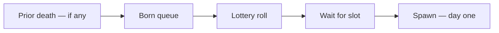
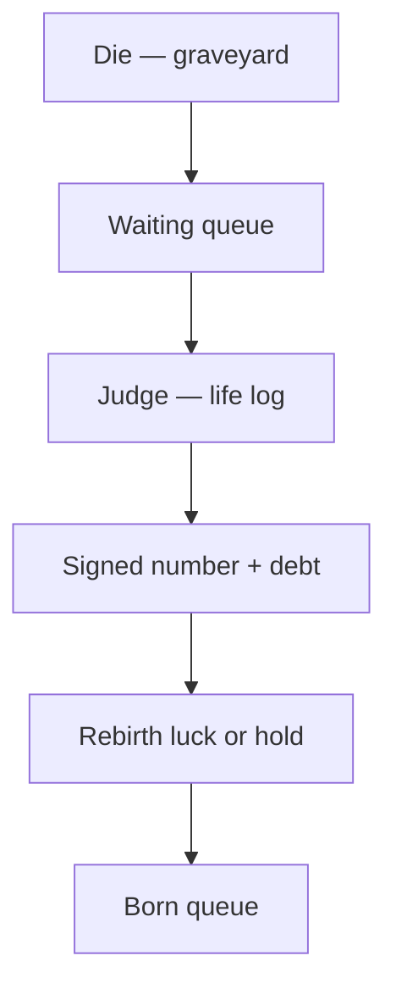
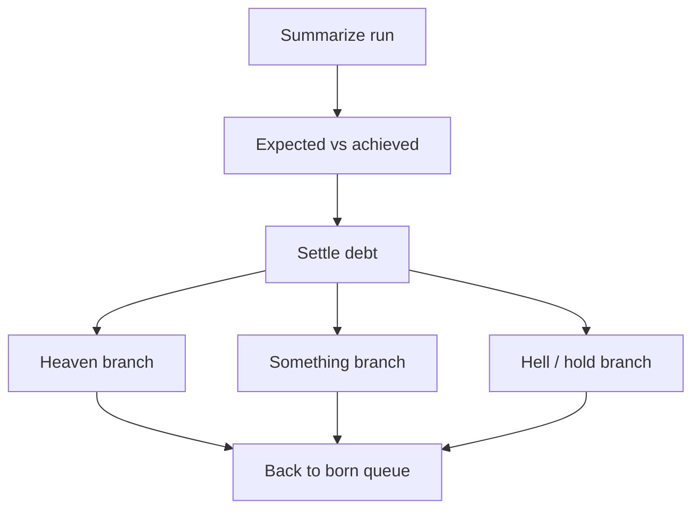

# 🔄 Restart — after death, before birth (hypothesis)

**What this is:** **optional fiction** about what **might** happen **after** graveyard and **before** the next born—queue, judge, life log, rebirth weights. **Not** how to play the match; that is
[play.md](./play.md). Alive path: [structures.md](./structures.md).

**Known for sure:** people **are born** and **die**. Everything below is **maybe**—useful for thinking, **not** something to expect.

---

## 📌 No guarantee (read first)

- **Maybe nothing** — random birth, random death, **no queue**, **no score**, **no second run**.
- **Maybe something** — wheel, replay, judge, weighted rebirth; **rules unstated** and **conflicting** across cultures.
- **Maybe corruption** — refs who **reassign your next spawn**, **skip your rebirth**, or **drop you into someone else’s sheet**—unprovable, **cannot plan on it**.
- **Best you can do:** **good choices while alive** and **leave a clean sheet if** post-death accounting exists—[harm § the loop](../fundamentals/harm.md#-the-loop--assess--post--reconcile),
  [fear-triage](../fundamentals/fear-triage.md).

Treat every node **before born** and **after die** as **hypothesis**. **No undo** on the prior run once judged—only **forward** into wait, hold, or queue.

---

## 🎲 Before life — born queue and lottery

**Story A (infinite wheel):** dead players return to a **born queue**—wait for a **mother / slot**, then **roll** (family, place, IV, EQ seed). **Day-one detail:** [born.md](./born.md).

---

## 📓 Life log and judgement

**If** self persists after body stop:

1. **Waiting queue** — disembodied hold (Uber transition, cemetery beat—**fiction handles**). You are **continuing** in another dimension—**not** editing the old sheet.
2. **Judge** — full **timeline review** from the **life log**: given **your spawn**, what was **expected** vs **achieved**? What was **right** vs **wrong** on **your** board?
3. **Signed number + debt** — harm ledger settled; see [harm.md](../fundamentals/harm.md).
4. **Rebirth luck** — positive → **better lottery weights**; negative → **colder roll** or **holding node** (hell / jail-Airbnb metaphor)—**delay before queue**.

<!-- begin table -->
| Score (hypothesis) | Next birth |
| --- | --- |
| **Strong +** | Safer region, healthier body, warmer family—**odds**, not certainty |
| **~0** | Another average ticket |
| **−** | Harder map, thinner security |
| **Deep −** | Long hold, pain tax, then queue |
<!-- end table -->

**Compare against:** peers with **similar kits** and **your own plausible best line**—not global leaderboard.

**Die early vs stay:** rage-quit from a **repairable** board might **forfeit** cleanup before ceremony—voluntary death (operational, not command).

---

## 🔁 Two continuity models (pick none as truth)

### 📌 Model 1 — Infinite wheel

Dead → **born queue** → **new** lottery → **new** life. Prior run **might** weight the next roll (**warmer or colder** spawn)—**Mario Party ceremony** metaphor: stars for **how you played your map**,
prize table **tilts odds**, not **pick exact character**.

### 📌 Model 2 — Replay same save

**Not** a fresh universe—**reborn into a very similar environment** (same region class, same family shape, same era). **Branch points** re-open: “if that event had gone differently…”
**Groundhog / roguelike retry**—test whether **different choices** on **specific beats** change the ending.

<!-- begin table -->
| | Infinite wheel | Replay |
| --- | --- | --- |
| **Map** | Often **new** roll | **Similar** board |
| **Question** | What **credit** did you bank? | Could you **patch** one timeline? |
| **Risk** | Cold lottery after bad sheet | **Stuck** in same class of problem |
<!-- end table -->

**Both can be false.** Default reality may be **one run, no queue**.

---

## 🎭 Heaven / hell — afterlife handles

Here, heaven / hell / **something** / jail-like nodes are **post-death branches** on the diagram—**one cultural map**, not proven cosmology. **Mindset** heaven/hell while embodied →
[society § mindsets](./../society/society.md#-mindsets-as-coarse-groups). **Planet teams** → [structures § hell vs heaven](./structures.md#%EF%B8%8F-hell-vs-heaven--two-teams-not-afterlife).

---

## ⚖️ Operator balance — life-game owner

The **owner of the life game** (metaphor) must **manage parity**:

<!-- begin table -->
| Goal | Mechanism |
| --- | --- |
| **Smart people → heaven side** | Institutions, status, **legible** reward for builders |
| **Angry people → hell side** | Grievance, **off-books** leverage, weapon craft |
| **Wrong assignment** | Equation **unstabilizes**—planet **nuked** in the model |
<!-- end table -->

Like **matchmaking**: pair **close skills** or invite **chaos**. Too much **disparity** → one-sided stomp → **no game** or **total wipe**. Hell’s **AI strategy** is **edge over heaven**, not
**god mode**. Pokémon parallel: [structures § Ash vs Rocket](./structures.md#-pokémon-read--ash-rocket-and-why-trouble-never-ends).

Cross-read: [play.md](./play.md) · [structures § ping pong](./structures.md#-ping-pong-hell-serves-heaven-defends).

---

## 🃏 Corruption clause

**If** the operator is **corrupt or bored**:

- **Reborn as anyone** — next run **not** tied to your sheet (identity shuffle).
- **Not reborn** — removed from queue; **permadeath** for the story.
- **Rigged lottery** — same hell-tier **on purpose** regardless of score.

**You cannot prove or prevent this in-model.** Do **not** optimize life assuming **fair rebirth**—optimize **alive play** and **clean accounting** ([harm § the
loop](../fundamentals/harm.md#-the-loop--assess--post--reconcile)) because **those pay either way**.

---

## ✅ Practical takeaway

<!-- begin table -->
| While alive | If afterlife exists |
| --- | --- |
| Accept IV/EQ; read meta; **routine** | Context-adjusted score **might** matter |
| **Good choices**; repair harm; avoid sabotage spiral | Debt **might** post after death |
| [play.md](./play.md) | **No guarantee** of reward—still **lower trouble** either way |
<!-- end table -->

---

## 🐜 Insect spawn variance (optional metaphor)

Same **one engine, many kits** at smaller scale—ant baseline, bee/spider/termite variants; **human** scale: [structures § species](./structures.md#-species-layer-humans-on-top). Human spawn:
[born.md](./born.md).

## 🧭 How this connects
