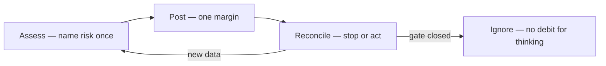

# ⚖️ Harm — who caused it, and what to do

**What this is:** the distilled harm read that replaced the old accident/voluntary/forced × death/pain/trauma **taxonomy**. Three questions matter — **who caused it, what it hit, and what to do now**
(the **Assess → Post → Reconcile** loop). Pairs with [hard-limit.md](./hard-limit.md) (the ends) and [fear-triage.md](./fear-triage.md) (which ones to spend on). **Metaphor only.**

---

## 🎯 Who caused it

<!-- begin table -->
| Cause | Means | Weight |
| --- | --- | --- |
| **Nobody / accident** | Physics, mistake, bad luck | Lowest blame — margins over rehearsal |
| **You / voluntary** | You stepped into it | Your lever — delay irreversible |
| **Another person / forced** | They chose harm | Highest — evidence + boundaries |
<!-- end table -->

The who changes the *response*, not always the *damage*. See [judgement.md](../perception/judgement.md) for ranking the damage itself.

---

## 🎯 What it hit

<!-- begin table -->
| Hit | Meaning | Reference |
| --- | --- | --- |
| **Run ended** | The hard limit — no cure, prevention only | [hard-limit.md](./hard-limit.md) |
| **Body hurt** | Pain, disability, chronic — tier by duration | [judgement § duration](../perception/judgement.md#-duration--cure-maintenance-or-forever) |
| **Mind hurt** | Trauma, shame, loops — often partial cure | [fear-triage.md](./fear-triage.md) |
<!-- end table -->

---

## 🔁 The loop — Assess → Post → Reconcile

The single most useful fear-work pattern, distilled from the old ledger:

<!-- begin table -->
| Step | Do | Trap |
| --- | --- | --- |
| **1. Assess** | Name the risk once — who, what, how bad | Endless "what if" with no new data |
| **2. Post** | One protective margin — helmet, boundary, exit, test, apology | Doing nothing when a lever exists |
| **3. Reconcile** | Stop — gate closed and not necessary now? | Treating rumination as progress |
<!-- end table -->

**Core rule: post one margin, don't grind +1 in rumination.** Naming what's broken is fine — the next move is **post** or **ignore**, not infinite rehearsal.

---

## 🧭 How this connects

<!-- begin table -->
| Topic | Hub |
| --- | --- |
| Ranking the damage (A–E) | [judgement.md](../perception/judgement.md) |
| What the fear actually is | [fear-triage.md](./fear-triage.md) |
| When the board breaks | [play § board breaks](../framework/play.md#-when-the-board-breaks) |
<!-- end table -->
