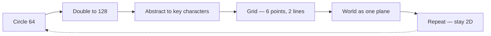
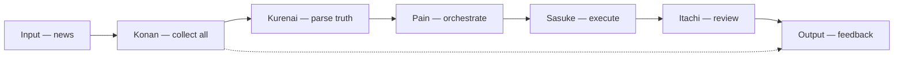

# 🎼 Orchestrator — how the village is managed

**What this is:** how a village is managed and why each thing happens — the orchestrator at the center, the team around it, and the theater that keeps order. Pairs with
[power-guns.md](./power-guns.md) (reaction styles), [anko-server.md](./anko-server.md) (the human conclusion), and [infinite-loop.md](./infinite-loop.md) (the loop machinery). **Metaphor only.**

## 📐 The line

A line with a point representing **−∞** and a point representing **+∞**, and potentially a middle point. Everything sits somewhere on it; the middle is where an orchestrator can see both ends.

## 🌀 The rotation pattern

A loop like Neji's pattern training: a circle that can be **grown** with some shrink shit. You comprehend **64 bits** and duplicate to **128**; then you abstract to the most important characters.

It can be seen as a matrix: you have **6 points** — 3 represent line A, 3 represent line B. Once you map these, you can build a **grid**. With that you understand the world as
if it were a single plane. From there you can do it again; a **3rd line introduces 3D**, but it is heavy to process — doing it many times with 2D is easier.

### 🔍 The zoom grid

Picture the Earth from the moon and take a picture: it is pretty much a **square** — a grid of information. If you filter the most important values, you can **zoom in and out**. Take a picture of the
Leaf Village, find the most important people, then zoom into their **habits**.

## 🎼 Nagato — the center

Nagato sits in the center, being an **orchestrator** — understands all possibilities and makes recommendations of what is best. It seems boring, but quite interesting for a person with some kind of
health problem: if you can't
walk much, the best you can do is be in a comfortable chair processing as much data as possible. God is curious about his conclusions; the devil is interested in how such power exists and keeps trying
to steal it.

## 🛡️ The team around the center

<!-- begin table -->
| Role | Character | Read |
| --- | --- | --- |
| **Borders** | Itachi | Quite close — defines the borders; great defender and counselor |
| **Attack** | Sasuke | Prefers to attack anything that gets close — keeps Itachi calm and more reasonable |
| **Wheel** | Naruto | Odd piece who can't do much but keeps the wheel spinning |
<!-- end table -->

A small team is quite strong; it makes some envious people want to destroy it. Still, without this team, they are going to be sabotaged. Removing the current leader makes them lose control.

## 🏘️ Why each thing happens

How a village is managed, and why each action occurs — the reasons behind the rules, the roles, and the theater.

## 🗺️ Mission map

Being aware of the **input**, the **processing**, and the **output**.

## 🎭 The vengeance theater

The loop: receive news of a death → investigate who is responsible → seek guidance of what to do → put someone to go after → review the results.

<!-- begin table -->
| Step | Role | Character |
| --- | --- | --- |
| Receives news | news receiver | Kurenai |
| Investigates the responsible | investigation | Shisui |
| Orchestrates the theater | director | Pain |
| Goes after the target | execution | Sasuke |
| Reviews results | reviewer | Itachi |
| Receives feedback | feedback provider | Konan |
<!-- end table -->

Some people provide news, some provide feedback; someone must filter what is correct and wrong. Pain holds the deck of cards and keeps accumulating stuff into Gedo.

## 🗞️ News: Konan & Kurenai

Konan receives **all** news — an all-in-one place aiming to not have a single data point lost. Still, she doesn't necessarily know what is true or not. Kurenai shows a similar version: she receives
odd news, and whenever a fact
doesn't make sense, she helps parse it — anxious for fake news so she can use the entire village at her disposal to review what is truthful. Konan is busy collecting all news while Kurenai is always
free to evaluate.

**The certainty problem** — Konan probably knows about everything, but what if someone removes one piece of paper from her shit? Pain controls water, but if everything is so complex
and secure, sometimes a single shit can get through — like going to sleep and not realizing you forgot something outside, then going there and it's not there anymore.

Certainty is very hard. If it disappeared, someone probably caught it — there are street cameras; they probably did something with it. Sometimes it is easier to discover something by finding the
culprit instead of iterating through each video; still, if you have no proof, a video can be regenerated.

**The data problem** — she probably doesn't share everything, otherwise the world would get disturbed; she seeks guidance about odd data. You know about a dead
person but are not sure who the assassin is — the body, but no video footage from the place. 50% of the population points to A, the rest to B.

She thought she had all data — but what if the crime happened in a place with no energy? Then you go to the street cameras, and they deleted the HDD — a crime with no evidence. What do you do? The
very best is to **investigate**:
the list of individuals present that day is definitely less than 1000, so you can start making questions. Konan's job is basically to hold the data she received; some evidence gets deleted and some
gets changed.

<!-- begin table -->
| Data | Meaning |
| --- | --- |
| `true` | Received as it happened |
| `lost` | Disappeared — simple |
| `generated` | Recreated or edited after the fact |
<!-- end table -->

What is the difference between true data and generated data? **Impossible to judge.** If you generated an image once, you can probably generate it twice; you can also edit. Very hard to say what the
original footage
is. Buy the same shirt with different colors and photograph each — the same picture with different colors; you can also edit the pixels of the original image. Somewhat impossible to distinguish.

## 🐍 The devil's mission

The devil's mission is to do something that Konan doesn't know or that Kurenai doesn't understand. In practice it probably doesn't happen — it's like making a
crime with some clues; they just don't know what to do yet and will eventually charge. The goal is to be as fast as possible to judge something.

## ⚖️ Rule costs

It may be the case the previous rules are not as good anymore — change the cost of some mistake. Say an assassination costs 20 years; then everyone from the village agrees to reduce it to 15. Still,
the wheel must keep spinning.

## 🦸 Every villager a superpower

Each individual in the village represents some kind of superpower to help others not need to become a hero nor a villain.

## 🔍 Orochimaru — the bored saboteur

Orochimaru is simply the most bored person who is seeking revenge and power. His mission is to make Konan look bad or Kurenai look stupid; their mission is to prove they don't lose shit.

## ⚙️ The fair system

Konan and Kurenai somewhat organize the fair system — like having all logs and knowing which are truthful. Then you must have a **priority queue** and people eager to pursue vengeance.

## 🔚 Close

The village is a theater run from the center: an orchestrator, a small team, a news-and-truth layer, and a vengeance queue. See [power-guns.md](./power-guns.md),
[truco-hierarchy.md](./truco-hierarchy.md), [anko-server.md](./anko-server.md), and [infinite-loop.md](./infinite-loop.md).
