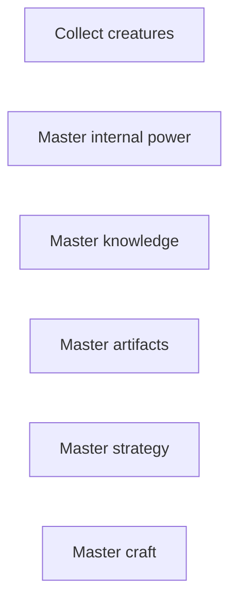
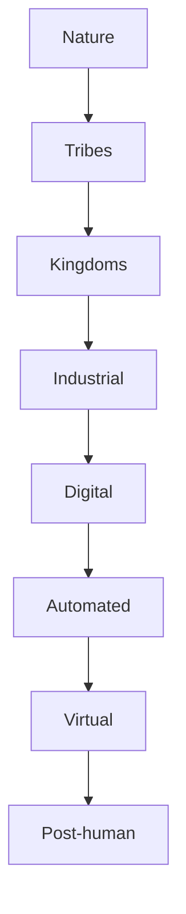
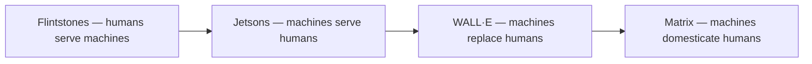
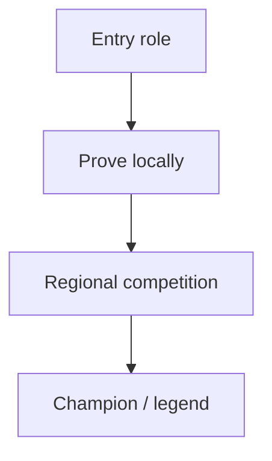

# 🧩 Patterns

**What this is:** recurring patterns — recognizable shapes across situations.

Cross-franchise comparison frames — reuse on any lore folder after **core of the media** is filled. Private draft; not a wiki. Seed: issue 49 (create lore).

**How to use:** Pick 2–4 patterns that fit the story; fill the franchise row in each table or add a **Lore patterns** block on the franchise file. Deeper civilization reads:
[futures](../society/futures.md).

## 🧭 Index

1. [Civilization ladder](#-civilization-ladder)
2. [Franchise fills](#-franchise-fills)
3. [Institutions](#%EF%B8%8F-institutions)
4. [Mastery axis](#-mastery-axis)
5. [Mastery path](#%EF%B8%8F-mastery-path)
6. [Resource scarcity](#-resource-scarcity)
7. [Signature items](#-signature-items)
8. [Tool progression](#%EF%B8%8F-tool-progression)
9. [Win and failure](#-win-and-failure)

---

## 📈 Mastery axis

What kind of power does the world ask you to master?

<!-- begin table -->
| Axis | Example franchises |
| --- | --- |
| **Collect** | Pokémon — species, teams, dex |
| **Internal power** | Naruto — chakra, lineage, jinchūriki |
| **Knowledge** | Harry Potter — spells, institutions of magic |
| **Artifacts** | Xiaolin Showdown — Shen Gong Wu |
| **Strategy** | Yu-Gi-Oh! — decks, rules, tournaments |
| **Craft** | SpongeBob, MasterChef, kitchen competition media |
<!-- end table -->

Many competition stories stack two axes (strategy + rare print run; grind + prophecy).

---

## 🪜 Civilization ladder

How advanced is society — and who serves whom?

**Film shorthand chain** (same argument, different stage):

Species-scale fork (automation, control pole): [futures § attractors](./../society/futures.md#-attractors-i-robot-vs-walle). **Deep read:** merged/civilization-ladder. Lore hubs: flintstones · jetsons
· wall-e · matrix.

---

## 🛠️ Tool progression

What tool replaces the previous tool?

<!-- begin table -->
| Franchise | Ladder (shorthand) |
| --- | --- |
| **Pokémon** | Poké Ball → Great → Ultra → Master |
| **Naruto** | Kunai → jutsu → kekkei genkai → sage → tailed beast |
| **Yu-Gi-Oh!** | Starter deck → rare prints → God cards → Items as antes |
| **Harry Potter** | Basic wand → specialty → advanced → forbidden |
<!-- end table -->

---

## 🏛️ Institutions

Who keeps order — and who fights whom?

<!-- begin table -->
| Franchise | Order | Opposition |
| --- | --- | --- |
| **Pokémon** | League, gyms, Elite Four, professors | Rocket, poachers, legendaries |
| **Naruto** | Hidden villages, Kage, ANBU | Akatsuki, rogue ninjas, war alliances |
| **Yu-Gi-Oh!** | Kaiba Corp, tournament refs, Pegasus industry | Cheaters, shadow games, dominators |
| **Harry Potter** | Hogwarts, Ministry, Aurors | Death Eaters |
| **Matrix** | Machines, Agents | Zion |
| **Breaking Bad** | DEA, legal medicine, cartel hierarchy | Rival cooks, pride, witness |
<!-- end table -->

Many plots are **institutions colliding**, not lone heroes.

---

## 🛤️ Mastery path

How does someone become elite?

<!-- begin table -->
| Franchise | Path |
| --- | --- |
| **Pokémon** | Trainer → gym challenger → League → Champion |
| **Naruto** | Academy → genin → chunin/jonin → Hokage dream |
| **Yu-Gi-Oh!** | Street duels → tournament brackets → item convergence |
| **Charlie (Wonka)** | Ticket holder → room trials → heir test |
<!-- end table -->

---

## 🎒 Signature items

Objects the audience instantly associates with the world.

<!-- begin table -->
| Franchise | Items |
| --- | --- |
| **Yu-Gi-Oh!** | Millennium Puzzle, God cards, Blue-Eyes |
| **Naruto** | Headband, kunai, scrolls |
| **Pokémon** | Poké Ball, badges, Pikachu silhouette |
| **Matrix** | Red pill, blue pill, sunglasses |
| **Charlie** | Golden ticket, Everlasting Gobstopper |
<!-- end table -->

Object powers + the binding that makes them hard to steal: [framework/balance.md § powers](../framework/balance.md#-powers-object-vs-person).

---

## 🍞 Resource scarcity

What is actually hard to obtain?

<!-- begin table -->
| Franchise | Scarce |
| --- | --- |
| **Pokémon** | Legendaries, shinies, perfect IVs, full dex |
| **Naruto** | Bloodline limits, tailed beasts, jutsu scrolls |
| **Yu-Gi-Oh!** | Rare prints, God cards, Items |
| **Breaking Bad** | Purity, trust, time, clean exit |
| **Charlie** | Tickets, factory access, family stability |
<!-- end table -->

---

## 🏆 Win and failure

<!-- begin table -->
| Franchise | Win | Failure |
| --- | --- | --- |
| **Pokémon** | Champion, dex complete (optional) | Status quo reset; friendship rhetoric vs capture |
| **Naruto** | Hokage, protect village | Hatred cycle, war |
| **Yu-Gi-Oh!** | Win fair game + empty hoard | Cheating, stolen antes, shadow stakes |
| **Breaking Bad** | Empire / legacy (Walter) | Pride, family loss |
| **Charlie** | Heir + keep family | Vice rooms eliminate you |
| **Matrix** | Escape simulation | Attachment to illusion |
| **SpongeBob** | Perfect patty, friends | Almost none — optimism indestructible |
<!-- end table -->

---

## 🧩 Franchise fills

Quick copy for franchise **Lore patterns** blocks — expand in thoughts/lenses.md when a pattern earns a full read.

### ⚔️ Competition · power

<!-- begin table -->
| Franchise | Mastery axis | Institutions | Scarce | Win |
| --- | --- | --- | --- | --- |
| Yu-Gi-Oh! | Strategy + print run | Kaiba Corp, Pegasus | Rare cards, Items | Tournament + hoard emptied |
| Naruto | Internal power | Villages, Kage | Lineage, beasts | Hokage, peace |
| Pokémon | Collect + bond | League, gyms | Legendaries, dex gaps | Master (Alola/Journeys) |
| Xiaolin Showdown | Artifacts | Temple, Heylin | Shen Gong Wu | Balance / seal Wuya |
| One Piece | Crew + will | World Govt, Marines | Poneglyphs, allies | Laugh Tale |
| Harry Potter | Knowledge | Ministry, Hogwarts | Artifacts | Preserve world |
| SpongeBob | Craft | Krusty Krab | Recognition | Perfect patty |
<!-- end table -->

### 🏛️ Civilization · aquarium

**Merged themes:** Aquarium · Civilization ladder

<!-- begin table -->
| Franchise | Ladder stage | Institutions | Scarce | Win |
| --- | --- | --- | --- | --- |
| Flintstones | Tribal / industrial mash | Quarry boss | Comfort, safety | Sitcom reset |
| Jetsons | Automated | Spacely | Comfort, automation | Sitcom reset |
| WALL·E | Automated → degeneration | Buy-n-Large | Soil, attention | Tend Earth again |
| Matrix | Virtual / post-human | Machines, Zion | Truth, body | Unplug / truce |
| Finding Nemo | Nature + aquarium | Ocean, human tanks | Safety, memory | Reunion |
| Finding Dory | Institute bubble | MLI | Memory, family | Reunion |
| Dora the Explorer | Guided map | Swiper / Map | Path knowledge | Destination |
| Truman Show | Monitored bubble | Show producers | Privacy | Exit door |
| One Punch Man | Contained arc (S1 ship) | Hero Assoc | Boredom | Win in one punch |
| Madagascar | Zoo vs wild | Central Park | Food, safety | Survive jungle |
<!-- end table -->

### 🎭 Satire · trickster · crime

**Merged themes:** Trickster archetype · Cartel economics · Mastery axis

<!-- begin table -->
| Franchise | Mastery axis | Institutions | Scarce | Win |
| --- | --- | --- | --- | --- |
| Felix the Cat | Escape craft | Chase only | Peace | Get away |
| Woody Woodpecker | Escape craft | Chase only | Peace | Get away |
| Pink Panther | Escape craft | Inspector | Peace | Evade |
| Looney Tunes | Escape craft | Chase only | Peace | Get away (short) |
| Narcos | Cartel ops | State, cartel | Trust, territory | Empire / survival |
| American Made | Smuggling craft | CIA-adjacent | Clear runs | Money / exit |
| Breaking Bad | Craft (chemistry) | Law, cartel | Purity, trust | Legacy vs confession |
| Better Call Saul | Craft (law) | Courts, cartel | Reputation | Survival |
| Harry Potter | Knowledge | Hogwarts, Ministry | Artifacts | Defeat Voldemort |
| SpongeBob | Craft (patty) | Krusty Krab | Formula | Perfect patty |
| Charlie | Craft + virtue | Wonka factory | Tickets, heir slot | Family + factory |
| The Simpsons | Episodic satire | Springfield | Permanent change | Weekly comfort |
| South Park | Kids articulate | Town, headlines | Moral high ground | Joke lands |
| BoJack Horseman | Accountability | Hollywood | Sobriety, repair | Growth sticks |
| Rick and Morty | Multiverse tech | Smith family | Stable care | Adventure + reset |
| Black Mirror | Moral complicity | Platforms | Privacy, memory | Survive tweak |
<!-- end table -->

## 🔚 Close
