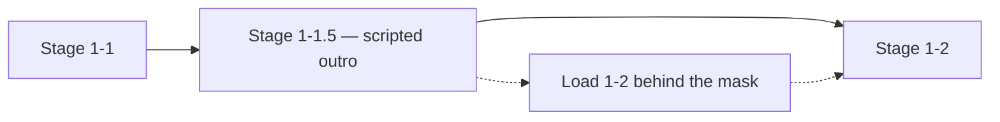

# 🕹️ Stages — transitions and load masks

**What this is:** how the sim moves you between **stages** (worlds, dimensions, life phases). The transition is a **loading screen disguised as a visual effect** — Matrix mirrors/doors/neck-plug
dramatize the same mechanic as Mario moving 1-1 → 1-2.

Key mechanism: the **1-1.5 load mask** — a hard-coded cinematic that plays while the next stage loads. Pairs with [worlds.md](./worlds.md) (§ two instances),
[possibilities.md](../framework/possibilities.md) (state changes), and [live-stream.md](./live-stream.md) (the feed stack). **Metaphor only.**

---

## 🚪 Transition = loading

Some movies show dimension-hopping through odd doors — a **mirror**, a **phone booth**, a **plug in the back of the head**. However it looks, it's the same mechanic:

> Mario reaches the finish line and moves from **stage 1-1** to **stage 1-2**.

- The red/blue pill, the mirror, the door = **a stage transition** ([worlds.md](../media/worlds.md#%EF%B8%8F-two-instances-not-one-flow) already reads the pill this way).
- The visuals are a **loading-screen effect** while the next stage gets ready.
- It's never magic — it's **advancing a level** with better dressing.

---

## 🏁 The 1-1.5 load mask

Here's the detail most reads skip: **how does the game load 1-2 while you're still playing?**

- After Mario crosses the **finish pole**, a **hard-coded animation** plays — the flag slides, Mario walks to the castle door. This is **1-1.5**: not really 1-1 anymore, not yet 1-2.
- The player **watches 1-1.5** while, in the back-end, **1-2 loads**.
- At that instant the game is **running both stages** — or one fading, one appearing — just long enough to hand off.
- Then **1-1 is already gone** — torn down, freed, no longer on the disk.

**The load mask** hides loading *inside fiction*: instead of a progress bar, you get a scripted moment. Every "impossible" transition in stories is just a well-dressed load mask.

---

## 🧵 Parallel vs overlapped instances

[worlds.md § two instances](./worlds.md#%EF%B8%8F-two-instances-not-one-flow) offers the clean **parallel** read — one player dead in A, a new one appearing in B. The **1-1.5** read is the **overlapped**
variant:

<!-- begin table -->
| Read | Old stage | Load happens | Example |
| --- | --- | --- | --- |
| **Parallel** | Dies instantly | While you're nowhere | Mario 64 painting jump |
| **Overlapped (1-1.5)** | Plays a scripted outro | Behind the outro animation | Finish-pole sequence |
<!-- end table -->

The best transitions **blend both**: the old stage plays a satisfying ending (so nothing feels cut), the next stage loads underneath, and the player never sees a loading screen.

---

## 🧭 How this connects

<!-- begin table -->
| Topic | Hub |
| --- | --- |
| Two instances, not one flow | [worlds § two instances](./worlds.md#%EF%B8%8F-two-instances-not-one-flow) |
| State transitions on the HUD | [possibilities.md](../framework/possibilities.md) |
| The red/blue pill read | [worlds § running game](./worlds.md#-life-as-a-running-game--bytes-on-a-disk) |
| The feed that renders each stage | [live-stream.md](./live-stream.md) |
| Post-death → next run | [restart.md](../framework/restart.md) |
<!-- end table -->

## 🔚 Close
