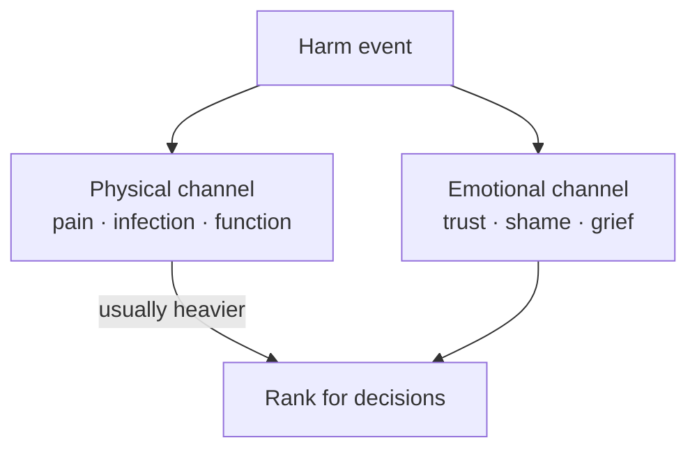

# 🧮 Life judgement — ranking harm

**What this is:** how to **weigh** bad outcomes when deciding, apologizing, or posting margins — not legal advice. **Two damage channels**, **how long it lasts**, and whether another person's body or
run was **non-recoverably** changed. Pairs with [fundamentals/harm.md](../fundamentals/harm.md) (the loop), [fear-triage.md](../fundamentals/fear-triage.md) (what's fixable), law-street-trust (proof
vs total cost).

---

## ⚖️ Two channels — emotional vs physical

<!-- begin table -->
| Channel | What it hits | Why it hurts | Typical fixability |
| --- | --- | --- | --- |
| **Emotional** | Trust, shame, grief, humiliation, betrayal *felt* | Story about you and others — identity, belonging | Often **partial or full** over years — therapy, new bonds, distance |
| **Physical** | Tissue, infection, pain nerves, organs, limbs | **Sensation** + health cascades + function | **Slower** — medicine helps; some damage **never** returns to baseline |
<!-- end table -->

**Default weight:** **physical ranks heavier** than emotional at the same duration tier. Emotional harm can be brutal — depression, ruined years — but the **body ledger** often has **harder floors**:
chronic pain, disability, lifelong meds, no regrow.

**Not a contest:** cheating can wreck someone emotionally *and* give them an STD. Stack both channels.



---

## ⏳ Duration — cure, maintenance, or forever

Split outcomes by **whether baseline can return**, not by how sad you feel the first week.

<!-- begin table -->
| Tier | Meaning | Examples |
| --- | --- | --- |
| **A — Full cure** | Known path back to “normal enough” | Many betrayals *without* body cost; clean-healing sprain; treated bacterial STI |
| **B — Managed chronic** | No erase, but **stable** with lifelong meds or routine | HIV on ART; HSV; diabetes; some nerve pain on pills |
| **C — Scar + tricks** | Body **different**; hacks not restoration | Malunited fracture; prosthetic limb; vision after laser — better, not original |
| **D — No real fix** | Permanent loss or dysfunction; **management only** | Amputation (no regrow); severe TBI; intractable pain; blindness |
| **E — Run ended** | Death — **no known cure** | [fear-triage § cure](../fundamentals/fear-triage.md) · [hard-limit](../fundamentals/hard-limit.md) **−∞** |
<!-- end table -->

**Medication forever** is tier **B**, not **A** — you are not “unchanged,” you are **maintained**. Still often better than **D**.

**Rule of thumb:** higher letter tier → **worse** when comparing same channel and same intent (accident vs forced).

---

## 🚫 Imposed on another — non-recoverable is worse

Most acts that **non-recoverably** change **another human** rank **above** the same damage done to yourself (voluntary) or by physics alone (accident).

<!-- begin table -->
| Lens | Question |
| --- | --- |
| **Recoverability for victim** | Can *they* get baseline back, or only manage? |
| **Agency** | Did someone **choose** to impose it? → forced stacks above accident |
| **Duration** | Tier **D** or **E** on their body or life → [harm § ledger](../fundamentals/harm.md) large / infinite |
<!-- end table -->

You do not need a court to **rank** this for your own margins — see law-street-trust § total cost.

---

## 🧪 Paired examples (same neighborhood, different weight)

<!-- begin table -->
| Event | Emotional | Physical | Duration (victim) | Rough read |
| --- | --- | --- | --- | --- |
| **Learn partner cheated** | High — grief, humiliation | Low — unless disclosed risk ignored | Often **A–B** emotionally (scar remains) | Bad; mostly **trust** ledger |
| **Catch STD from undisclosed partner** | High — betrayal | **High** — infection, clinic, disclosure | **A–B** by bug — HIV **B** (heaviest), HPV often **A**, bacterial **A** | **Worse than cheating alone** — body + trust |
| **Clean broken bone** | Medium — fear, dependency | High — pain, rehab | Often **A–C** — may heal wrong | Physical pain + disability risk |
| **Lost limb** | High — identity, grief | **Very high** — pain, phantom, function | **D** — no regrow; prosthetic is **trick** | Among worst **survivable** physical tiers |
| **Assassination** | — (others grieve) | Total | **E** | **−∞** — victim's run ended |
<!-- end table -->

**Cheated vs STD:** knowing hurts; **carrying a lifelong infection** (or years of treatment) is **worse** on the **physical + duration** axes even when the emotional story is equally ugly.

**Broken bone vs lost limb:** both “physical,” but limb is **tier D** — no fix, only **adaptation**. Bone might land **A** or **C** depending on healing.

---

## 📊 STI stack — rank by duration (not moral theater)

**Among common infections**, rank by **how long the body ledger stays open** and **how heavy maintenance is** — not by how “gross” symptoms look the first week. Clinical detail: `health/` PDF vault.
**Not medical advice** — test and treat with a clinic.

<!-- begin table -->
| Rank | Bug (examples) | Duration tier | Cure shape | Why it ranks here |
| --- | --- | --- | --- | --- |
| **1 — heaviest** | **HIV** | **B** — forever on the books | **No erase.** **ART** keeps virus **undetectable** — transmission risk drops when suppressed; **not** “cured.” | **Worst common STI in this model** — permanent identity + meds + disclosure math, even when controlled |
| (cont.) | | | Cost often **manageable**; **tradeoffs** — metabolic shifts, weight/lipid effects, lifelong pharmacy tie-in | |
| **2** | **HSV** (herpes) | **B** | Antivirals reduce outbreaks; body keeps virus | Lifelong; often manageable; stigma heavy |
| **3** | **HPV** | **A → B** | **Vaccine** prevents many strains; **most infections clear in ~1–2 years** on their own | Less heavy than HIV — often **temporary carriage**; vaccine is real margin |
| (cont.) | | | persistent high-risk strains → monitoring / wart / cancer pathway (**C** if bad outcome) | |
| **4** | **Hep B** (if chronic) | **B** | Some clear; chronic needs monitoring / meds | Serious but not identical to HIV story |
| **5 — lighter** | **Chlamydia, gonorrhea, syphilis (caught early)** | **A** | Antibiotics — **needs prompt care**; ugly/discomfort real; **often gone quickly** when treated | High **acute** annoyance; low **lifelong** rank if treated |
| **6 — lightest** | **Trich, pubic lice, bacterial vaginosis-class** | **A** | Treat and move on | Immediate attention; short runway |
<!-- end table -->

```text
HIV >>> HSV chronic > HPV (often clears) > bacterial "treat this week"
```

**HSV vs HPV:** herpes is **usually lifelong latent (B)**; HPV **often self-clears (A)** with a **two-year-ish** window — still get screened; still vaccinate if eligible.

**HIV on ART:** think **tier B managed** — not **A** (you are maintained, not restored to “never happened”), not **D** (life and function usually continue). Side-effect lottery is real;
**undetectable ≠ zero cost.**

---

## 🧬 Acquisition — accident, story, and vectors

**Ledger split:** **how bad if true** (tables above) ≠ **how you got it** (intent / accident / unknown). A **tier-B HIV** diagnosis from a **one-time condom break** is the **same body tier** as from
betrayal — **moral** posting differs (accident vs forced); **clinic path** does not.

### ⚠️ Accidental routes people fear

<!-- begin table -->
| Route (fear or story) | Typical real-world weight | Margin |
| --- | --- | --- |
| **Undisclosed partner / recent new contact** | **Highest plausibility** for most STIs | Test window, condoms, disclose, partner notify |
| **Shared towel, gym seat, hot tub, pool** | **Very low** for HIV; **low** for most STIs — viruses/bacteria die fast outside host | Don't torture yourself; if anxious, **one test** then reconcile |
| (cont.) | need **mucous membrane** or **blood-to-blood** | |
| **Unknown / “no idea when”** | Common emotionally — biology is often **recent** partner or **prior** asymptomatic carriage | Timeline with clinician; repeat test at window end |
| **Blood draw, dental, tattoo (licensed)** | **Extremely low** in regulated settings | Use licensed providers; report needlestick protocols |
| **Mosquito / insect after blood exposure** | **Fear link:** HIV is **blood-borne** · **Established fact:** HIV **does not** transmit via mosquitoes | If worry is **outdoor blood anxiety**, rank the **fear** (voluntary/trauma); don't add fake physics |
| (cont.) | virus does **not** replicate in the insect like malaria; no epidemiological pattern | |
| **Pregnancy / birth** (vertical) | Real pathway for some infections — medical protocols exist | Prenatal screen |
<!-- end table -->

**Keep both books:**

1. **Body tier** — if infected, rank the bug ([§ STI stack](#-sti-stack--rank-by-duration-not-moral-theater)).
2. **Intent tier** — accident, reckless you, or another person’s concealment → different **karma** posting, same **clinic**.

**Pool / towel / air:** mostly **anxiety-grade** for HIV; **not** zero for all germs in theory, but **far** below unprotected sex or shared needles. Post **test + stop furnishing**, not infinite “what
if the deck chair” loops.

**Mosquitoes:** other diseases (malaria, dengue, Zika) are **mosquito-real**; **HIV is not in that bucket.** Blood origin ≠ every blood-adjacent fantasy vector.

---

## 📖 How to use this (decisions, not rumination)

1. **Name both channels** — emotional-only vs body involved.
2. **Assign duration tier** — A through E for **each** channel that applies.
3. **Check victim** — if you caused **D/E** on another person, weight [harm.md](../fundamentals/harm.md) and amends accordingly.
4. **Post one margin** — test, boundary, apology with restitution, safety gear — then reconcile.

Do not use this table to **minimize** emotional harm (“it's only feelings”). Use it to **not under-weight** body harm when guilt is invisible (private sex, “no proof”).

---

## 🔗 How this connects elsewhere

<!-- begin table -->
| Topic | Hub |
| --- | --- |
| Ledger postings (+/−, −∞) | [harm § the loop](../fundamentals/harm.md#-the-loop--assess--post--reconcile) |
| Death / pain / trauma cure detail | [fear-triage § cure](../fundamentals/fear-triage.md) · [hard-limit](../fundamentals/hard-limit.md) |
| STI duration stack | [§ STI stack](./judgement.md#-sti-stack--rank-by-duration-not-moral-theater) |
| Law vs street vs personal cost | law-street-trust |
| Prize vs price in choices | decisions |
| Labelling a guess (prejudice) | [prejudice.md](./prejudice.md) |
| Justice vs vengeance | society § fix |
<!-- end table -->

---

## 🧭 How this connects
