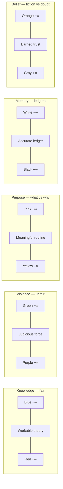

# 🎥 Monitoring — the always-streaming sim world

**What this is:** the premise that everyone is a sim streaming life 24/7 — and what that does to security, privacy, and meaning. **Foundation:** everyone is a monitored sim, and who
you become is shaped by those who raise you (same choices, similar lines of thought) — which is why power matches the person, and why impersonation is detectable.

Pairs with [balance.md](../framework/balance.md) (the watcher is the tuner) and [aquarium.md](../media/aquarium.md) (the managed bubble). **Metaphor only.**

**Closest game reads:** The Sims · The Truman Show · The Matrix.

---

## 📡 Total-stream premise

If I were a The Sims player, it means someone else definitely manages the real life video game. Like Morpheus watching over Neo in The Matrix. All thoughts, vision and actions can be monitored. It's
pretty much like playing The Sims and watching over all others.

Now take it further: civilians are like sims who **stream their life**. You're monitored 24h — when in bathroom, when in bed, when in kitchen, when in the streets. It's unrelated from network or
electricity: the monitoring is intrinsic to the simulation, not a technical add-on.

- The **owner** of the game knows everything by definition — it's a game running in a computer.
- But if you share a sim's data with **another sim**, that sim's privacy is gone. Sharing one life with all the others is the mesh that ends privacy.

---

## 🧮 Formal inclusion/exclusion — the set reading

Privacy as a **set problem**:

- Each sim's stream = a set of exposed events.
- **Privacy = the complement of the union of streams.**
- One viewer → private set shrinks. Full all-to-all mesh → private set = ∅.

```text
private = U \ (stream₁ ∪ stream₂ ∪ … ∪ streamₙ)
```

With everyone streaming to everyone, nothing is outside the union. Which makes crime a paradox: **how can people commit a crime while sharing their life?** The exposure is total — the act is visible
before, during, and after.

---

## 🕳️ What collapses (excluded from meaning)

In a world where everyone streams, security and privacy lose purpose:

<!-- begin table -->
| Thing | Private world | Total-stream world |
| --- | --- | --- |
| **Security / privacy** | Purpose | No purpose — relevant only when the individual feels like it |
| **Crime** | Possible, hidden | Instantly known |
| **Sex** | Private act | Becomes a porn video |
| **Conversation** | Private | Becomes a live podcast |
| **Secrets** | Keepable | A file in a shared folder |
<!-- end table -->

Privacy is only relevant when the individual feels like it. Otherwise, you lose purpose around security.

---

## 🌱 What survives (included)

Still, regardless of being a streamer, you pretty much have a **normal life** — needs, routine, work, relationships ([play.md](../framework/play.md)). Just some things aren't applicable. Privacy
re-enters only as a **felt** toggle — a subjective switch, not a structural guarantee.

---

## 💻 localhost / OS analogy

The monitored world behaves like a **localhost server** that all other processes can access — or simply a file in a shared folder:

- All processes run in the **same OS** → all of them can be killed or updated.
- A terminal can **force a signal** — override commands to other people (see [Rod override](#%EF%B8%8F-rod-override)).
- **Server reality** — a virtual world / corporate server trap (Virtual World, DuelTek) shows the frame itself is software: whoever owns the server owns the rules. Even the monitor can be compromised.

---

## 👁️ Monitoring superpower — Millennium Eye (Pegasus)

The creator can attach a superpower to an object. The **Millennium Eye** is the monitoring object-power: read thoughts and eyesight, see through cards. The anime literalizes surveillance into an
artifact — the owner who watches made monitoring itself a power.

Same family: the **Millennium Ring** as a compass (mapping/nudging people into place) and the **Millennium Puzzle** as a DJ of personalities (persona-swapping). See
[balance.md § item examples](../framework/balance.md#-item-examples).

---

## 🎛️ Rod override

The OS/terminal metaphor explains overriding commands to other people: **all processes run in the same OS, so all of them can be killed or updated.** Use a terminal to force a signal. The
**Millennium Rod** (Marik) is the dramatized version — mind control, forced obedience. See [balance.md § referee](../framework/balance.md#%EF%B8%8F-referee-the-secure-environment).

---

## 🏢 Kaiba methodology — protection via lack of privacy

The methodology of protection is unfortunately the **lack of privacy**: the referee protects the championship by making everything visible — who owns which card, who uses it, where it was last seen.
Monitoring as the cost of a fair game ([fair-game.md](../framework/fair-game.md)). The watcher is the tuner ([balance.md](../framework/balance.md)).

---

## 🚨 Enforcement paradox

Crimes become a bit odd: given that everyone is monitored, **why can't police simply control the population?**

- **Not enough officers** to prevent everything.
- **Corruption within the police itself** — like to know about something and do nothing, simply for the sake of hating the person currently being attacked.

**The monitor's jurisdiction is the frame, not life** — monitoring sees everything, but enforcement only acts inside the rules. Health, disability, kitchen knives fall outside any monitor's authority:
*who deserves to suffer and why* is unanswerable within the frame. **Watching ≠ fixing.**

**Traceability, not prevention** — monitoring's real power is pinning the last use, not stopping the act. And the hard target is the **person**, not the object — kidnapping the
owner beats stealing the card. Enforcement is episodic, not systemic: cheaters win until caught; the ideal answer is *technology over honor* (Kaiba's machines).

---

## 🧭 Policy

Being afraid of it is generally irrelevant, since you have no control over it. Trying to think it doesn't exist may be helpful, since there's nothing that can be done against it.

It is also possible that the owner of the game decided to share a specific sim life with others, somewhat like what happens in The Truman Show. In a video game, everything is possible. You can simply
spawn one bot to be a life streamer while others watch, etc.

That said, it's generally useless to depend on being the streamer as some kind of defense. Even a live streamer can be attacked or sabotaged. Being the streamer sim
may grant some protection due to fear of consequences from others, but it doesn't make it impossible to be hurt. Being afraid of it also doesn't help.

Unlikely to cause any impact by being angry about it. It's like 1 vs 1 trillion. At best you can offend people through telepathy or so. Quite easy to overreact while nothing happens.

---

## 📡 Live streamer / Truman

The worst case is being **Truman**: everyone watches you, you watch no one. But a **live streamer is rare** — and total coverage of *everyone* is very unlikely. It's possible, but not a given.

Truman himself is among those who **suffer the most** — still, he's **not a victim of physical torture**. Could have been way worse.

**The plumbing of this premise** — camera → server → client, and a rare streamer being watched by family instead of a director — is the [live-stream read](../media/live-stream.md).

**Black Mirror lanes:** *Nosedive* is the score version — reputation as a visible currency, everyone watching everyone's number; *Fifteen Million Merits* is the grind that earns the score in the first place.

---

## 🕵️ Why crime still happens if monitored

If someone truly had access to every piece of data, crimes would never happen — serial killers would keep getting caught, torture wouldn't continue. Since they do, the criminal is **not teleporting**
to the crime scene. Either:

- the **responsible party watches and does nothing** — like a bird that can see but can't speak or attack, or
- the person is simply **out of range**.

Don't dismiss monitoring (Big Brother is a simple example, Truman a complex one) — but **assuming everyone is monitored is very unlikely**.

---

## 🔋 Energy windows — the blackout gap

Standard methods all depend on **energy**. An accident can put a neighborhood **out of electricity** — a time range with **no proof**. Given a crime happens and the criminal disappears, there's
**no justice**.

---

## ☸️ Karma's fairness ceiling

Karma proposes fairness through some kind of **equal response**. But crimes like **loss of limb and serial killers** are its weakness:

- Unless someone can **recover limbs and revive people**, true fairness is impossible.
- At best you're forced to keep the criminal alive and suffering through some alternative method — which is **your own interpretation from a dead body**.
- A serial killer would need to **revive the dead bodies** or be revived itself.
- Someone who accidentally exploded a bomb and killed lots of people then suffers forever **due to a mistake** — fairness is deeply complex.

---

## ⚖️ Equivalent-action justice

Given that everyone is monitored, **no crime should happen**. If one did, there'd be **no need for judge or lawyers** — simply **rewatch the scene and take an equivalent action**.

Anything else is **payback with reduced damage**: exploding a building and having your car exploded is definitely not the same thing. It's like balance achieved by the
**minimum impact that satisfies those complaining** — and each person has a different opinion of what is sufficient to them.

Most of the time people complain; the best is to keep pursuing this **perfect balance**. **Infinite war is not the answer** — it's a load test to check who's currently
strongest, somewhat helping to rank others. The highest-ranked individual would be the hardest to please, but probably busy managing those with less rank.

**Black Mirror lane:** *White Bear* literalizes crowd-as-justice — the monitored punishment loop replayed daily for an audience, the "equivalent action" turned into entertainment.

---

## ⚽ VAR — director's evidence, no judge needed

VAR is the model for a tool that **exists but doesn't fix everything** — and it's a *monitoring* frame, closer to **Truman from the director's POV** than to a Big Brother way of life. If a crime
happens with Truman, **they have all the evidence**: angles, replay, geometry matching.

- With all the data, the verdict is **automatic** — culprit or not. **No judge needed** for the verdict itself.
- The judge's real job becomes managing **sentiments around the already-proved result** — postponing so the culprit enjoys life a bit longer before paying.
- In soccer the rules are well-defined (goal or not); delay only builds viewer curiosity — it could be **instant on the display**.
- A human judge is kept for when the **system isn't sharp yet** — some accident happened. But the judge could have **blinked** at the moment; a machine is easier to trust than a human.
- Society still picks a human to **own responsibility for future choices** — arguably the hardest task. The machine has **no sentiment and no attachment**; people can **nuke and reconstruct it**.
- The core reason: **reversibility**. Putting someone in jail isn't always easy to reverse — death row cost, body damage, a life altered inside.
  If the decision were fully reversible, it'd be a very simple call — machine-made, instant.

**Illegal evidence — the Lula case:** even with all the angles, **how you got the proof matters**. Brazil's Lula case: all evidence of money laundering and an apartment purchase existed, but the
**nature of the evidence** (collected illegally) meant it **didn't go through**.

If you do an **illegal thing to collect a proof**, you can't use that proof against the person. **Killing an assassin swaps who's being prosecuted:** you were angry at the original killer; the one who
killed them turned the killer into a **victim** — and became an **assassin** in their place.

**Tranquilizer note:** police could simply **sedate** (lion-tranquilizer-grade chemicals) instead of shooting — doesn't hurt much, stops the person immediately, carry them to the cell.

---

## 👮 Police-monitoring paradox

The most likely people to have monitoring access would be the **police** — but then it makes no sense:

- What prevents them from being **in the right place at the right time**? You don't need much effort to **pause a criminal during their path** to the crime scene — simply catch the person
  **with a gun before allowing them to fire**.
- If it's not the police, then it's **some kind of Big Brother** — and for the person being streamed, that's a **hell world**: they can't live life normally and make **no money from it**.

---

## 🏦 Truman's artificial institutions collapse

Some things are obscure for Truman:

- **What is the purpose of a job interview or a bank password?** People may mask them as needed, but they rarely are. If people watched each second of your life, what you get done in a
  **5-hour time window** is probably irrelevant.
- **Application → offer is a single human email.** A simple hack could make you hired; someone armed could force the interviewer to transfer money and get away — receiving a salary before even getting
  the job.
- **Rules only exist when people face consequences.** Unless cost is forced, there are no rules. People only fear killing if they are sure to go to jail. When there's no fairness,
  **assassination is allowed and no one cares about dead bodies**.
- An **interview is meant to test someone — pointless when you're interviewing a 24h live streamer.** It's like a real-life video game where the director crafts entertainment for the viewers and
  profits from the content.
- It's probably **not very likely for Truman to get out** of being a streamer — a forever Big Brother participant. Still, people could at least send **money or supplies** — otherwise it's a
  **live stream of torture**.

---

## 🤔 Monitoring's inconsistent cost

Kind of confused about cost: people can monitor a person **buying and consuming drugs**, but then complain when they **kill someone**. Is it about:

- avoiding a **specific crime**?
- **not doing it with a specific person**?
- finding the **right methodology to hide it**?

---

## 🎨 Color tiers — paired axes

**Who knows what about the stream.** The always-streaming world read as **paired axes** — each pair is a line with a **−∞ pole**, a **middle** (the healthy balance), and a **+∞ pole**. Same grammar as
[play § personal poles](../framework/play.md#-personal-poles-middles) and the paired opposites in [masks.md](./masks.md).

Mirrors [structures § hell vs heaven](../framework/structures.md#%EF%B8%8F-hell-vs-heaven--two-teams-not-afterlife) and [restart § operator balance](../framework/restart.md#%EF%B8%8F-operator-balance--life-game-owner).
**Metaphor only — no claim about real people's knowledge.**

<!-- begin table -->
| Axis | −∞ pole | Middle | +∞ pole |
| --- | --- | --- | --- |
| **Knowledge** | 🔵 **Blue** — open theories that never terminate ("predict all primes"), can't finish | **Workable theory** — complete enough to act | 🔴 **Red** — the finished perfect theory; crafts the algorithm |
| **Violence** | 🟢 **Green** — the lazy shortcut ("why not just shoot?"), results without effort | **Judicious force** — enforcement when needed | 💜 **Purple** — passionate violence + revenge (→ hospital → jail) |
| **Purpose** | 🩷 **Pink** — pure routine, says *what* to do, no why | **Meaningful routine** — structure with a why | 💛 **Yellow** — gives you *something to work*, anti-suicide meaning |
| **Memory** | ⚪ **White** — database of good things only | **Accurate ledger** — good and mistakes both recorded | ⚫ **Black** — database of mistakes only |
| **Belief** | 🟠 **Orange** — fabricates alternate realities; everyone believes them | **Earned trust** — behavior over story | ⚪ **Gray** — reads through every lie, can't believe in shit |
<!-- end table -->

### 💠 Knowledge — blue opens, red finishes

Blue's theories are stupid but valid — a suggested pattern that never gets proven (predict all primes). Red takes it and crafts the algorithm. They compete **fairly, no violence**.

- **Red is capped** — score-10 on a not-so-complex test; can't stop at that score, can't be put to work on what a pink can't know. A pink guards over a red without ever telling them.
- **The red↔blue trade:** blue knows the stream is total and never bothers (born with AI, no study, "a bit stupider"); red never knew and grinds in "private" hours that were never private. Blue trades
  depth for awareness; red trades awareness for depth.

### 💥 Violence — green and purple propagate it

Initially bad, but **structurally required** — without it there's no jail, judge, or hospital. People need to get hurt so a hospital fixes them and the culprit goes to jail; otherwise we'd live in a
perfect world needing nothing.

- **Green's shortcut** — "why not just shoot the person?" If it were about assassination there'd be no job interview — go to the office, collect the payment directly from the rich interviewer. The
  ceremony exists because the gun path has a cost ([Truman's artificial institutions collapse](#-trumans-artificial-institutions-collapse)). The unfair competition, or fair violence when possible.
- **Purple's engine** — [society § vengeance wheel](../society/society.md#%EF%B8%8F-vengeance-wheel--group-conflict-engine) · [structures § rules/judge](../framework/structures.md#-rules-fair-vs-unfair-judge).

### 🎯 Purpose — pink gives the what, yellow the why

Pink crafts the perfect routine and says what you should work. Yellow is the opposite — anti-suicide meaning, something to work *for*. If you don't understand why you should do it, ask a yellow
person.

- **Yellow's bias** — even with eyes on everyone you can't take care of everyone; you attend to those you agree with, and may put your *worst* worker on someone you hate. Efficient yellow vs
  not-so-efficient yellow — "someone falls too much when walking due to being managed by a stupid person" ([enforcement paradox](#-enforcement-paradox)).
- **Pink's mirror** — thinks the watch is *their* private superpower; by the same logic someone else can watch them in the shower, record, and share ([monitoring's inconsistent
  cost](#-monitorings-inconsistent-cost)).

### 🧠 Memory — white holds good, black holds mistakes

Both are record-keepers looking for the **best** and the **worst**. White trusts "people have a camera," that's it — church types can't realize they're monitored. Black knows the full path but is
empty inside — no privacy at all *and* no sentiment (karma's fairness ceiling).

### 🕵️ Belief — orange fabricates, gray reads through

Orange crafts fake stories (the child, the YES/NO paper) and thinks everyone believes them — and most people actually do. Gray is the one who can't believe in shit. The smart path (accept the
infertility, find another goal, stimulate the routine) lands on gray.

- **Gray's stance** — on the heaven/hell fence: knows it's monitored, not depressed, spectates with some joy. "Why grind for the 10 when I can relax watching people compete?"



---

## 🤖 Suffering at scale — bot pain

**What this is:** the moral-scale question of the sim premise — at what **complexity** does a simulated player genuinely suffer, and why the creator never feels it. Pairs with
[structures § species layer](../framework/structures.md#-species-layer-humans-on-top) (zooming out) — this is the reverse, zooming **in**.

- **Bot-to-bot is all we have** — interaction is limited to sims. The creator doesn't comprehend what pain is within a bot player.
- **Complexity threshold** — start a Sims container and there's no sentiment over the video-game player. But a game complex enough — GTA with five senses and a mental
  layer — makes a suffering bot plausibly go through the same experience as you. A perfect copy of life is basically watching over people's suffering.
- **Zoom granularity** — like Pokémon: people keep creating new versions and are curious how they interact. Zoom in far enough and maybe a Pokémon could have sentiments.
- **Hope-mode verdict** — trusting that life is a game *and* that the owner will do anything is stupid. Accept life as is; focus on human-to-human interaction. Wondering too much about god and the
  owner is **hope mode** — wasting time asking for a favor. If they already watch 24h of your life, the job interview was never for gathering info — just a compliance ceremony to hire the person they
  already wanted ([Truman's artificial institutions collapse](#-trumans-artificial-institutions-collapse)).

---

## 🧠 Monitoring, not mind control

There's no mind control to worry about — if life is a game, it's simply **picking a sim and putting it to do what you need**: automated mode on pre-defined behavior, or a specific set of actions
you chose for that moment. Any interpretation on top is **heavily decorated**. The Sims explains a lot of how life works; god is the church representation of the game maintainer.

Trying to have privacy is like having autism for a period of time. Being realistic means **accepting you're monitored the entire time** — but then, by who? The game owner who also monitors
everyone else? It works regardless of location or environment; closing your eyes or moving to an island doesn't change shit. We're like sims in a game. If not, then there's no rule.

---

## 🎛️ The maintainer's attention

Very hard to pay attention to everyone. Each person **can be seen**, but quite hard to follow everyone. If you're paying attention to a screen, you're probably far
enough to feel safe — at best you'd call someone to take action. If you're watching from the comfort of your home, it's possible **you've been hacked**.

Like a water flow in the house: a tube moves it to your house, and a single individual in the streets can put **poison in the water while you sleep**. Impossible to pay attention to everything. Better
to accept some life risks and worry about what you worry about most.

---

## 📡 ISP and confirmation

When you load YouTube, you request through the **ISP**, which can bypass the content and show you exactly what they want — like a caveman. Even if you share with the entire planet, you get
confirmation by friends agreeing and perceiving online responses to your actions — still, hard to be sure.

Like death: a similar body, close people at the graveyard, and the government confirms — it looks realistic. If the person had a similar friend who died and people couldn't distinguish, that's it.

---

## 🧿 Eyesight-only streaming — the kidnap gap

Even if people stream with their eyesight only, what about being **kidnapped with eyes closed**? How can they track the location of the person? They monitor thoughts, but how do you know where you
are? Your phone disappeared. Is your body a computer with some kind of GPS tracker?

Unless life is a game and your body is like a robot, you **can't be traced** — people see your last moments and that's it. The person entered a car; from there, only street cameras. They entered a
road with no camera, and the vehicle isn't found anywhere else.

With enough street cameras you get a **radius of location**: two cameras 50km apart → it's probably in that range. With drones and research, findable quickly.

But underground? A bunker with an entrance in an unmonitored region — you can enter a maze underground. Unless you're a robot with open-source privacy, no way to be found. People take a
long time to find the entrance, then the room where the person is. Not impossible, but if well hidden, it takes a long time — a 3D maze of doors without internet connection.

Underground, a maze with 10 nested rooms — each takes ~1 hour with the thickest saw machine and enough battery. You're ~10 hours away — enough time to torture someone for quite a while.

If they monitor everyone, they'd have seen the person crafting the maze and the kidnapping — it makes no sense. Perhaps that's how the life-game is made: they **allow people to be angry and craft
plans, then act when they think it's needed**. Let the police do their work — superheroes appear when such things happen. Police would take a decade to find it and go through standard procedures.

How do you know the specific entrance in a 50km radius? It can be any rabbit hole covered. Even when you enter, what if there are traps? It's like an **onion** — layers with distinct
weaknesses take a long time. No electricity → lots of batteries needed. If it's a pyramid and the person is still alive, you're limited by the time to go through each layer.

If life is a game, they could simply press a button to **teleport** the person — way quicker than any other shit. If there's only monitoring, they may have an idea of location, but still some
discovery to do.

Any well-hidden bunker is hard to find and enter — no drone can see it from the sky. How do you identify an individual making a hole in all square meters of the planet? What if they start from a
**volcano** and go from there? Then
go sideways and reactivate that volcano with enough bombs thrown into the bottom of it? They've somewhat hidden themselves in a place very hard to achieve — you'd need to dig from the surface to quite
some depth.

## 🧭 How this connects
