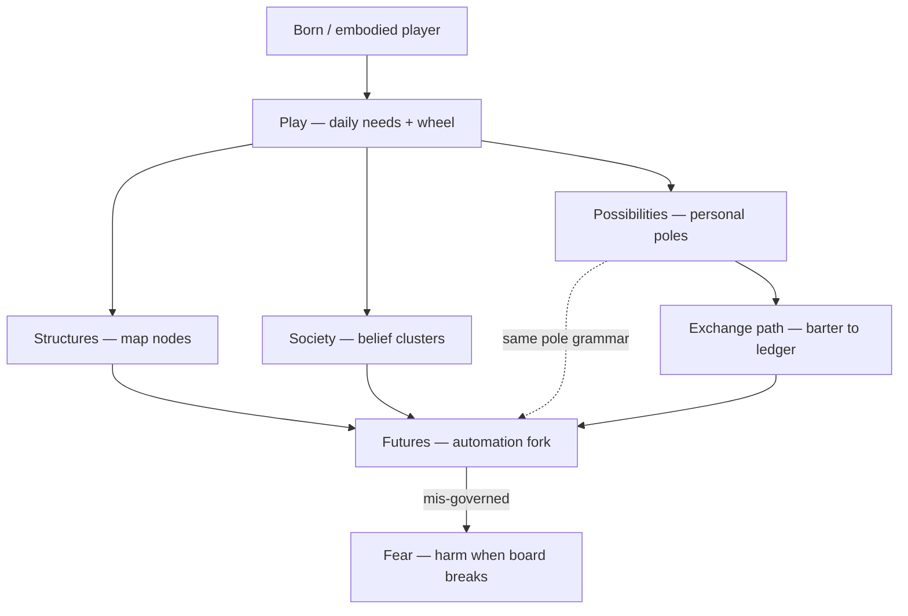
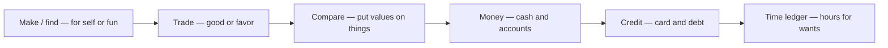
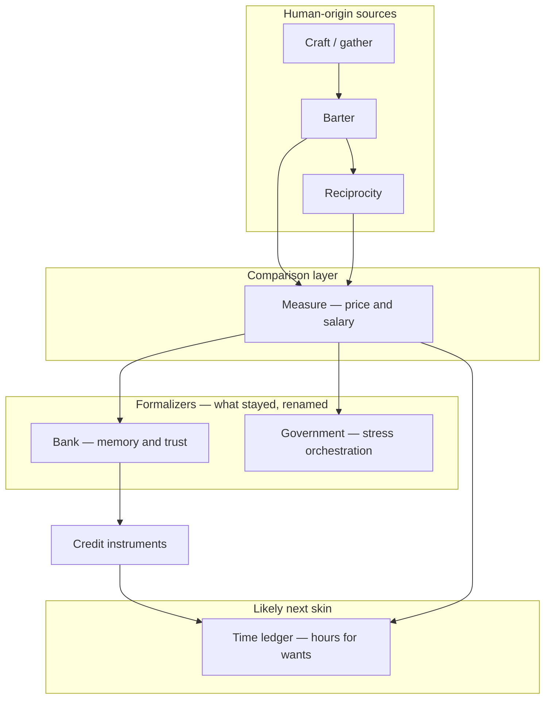
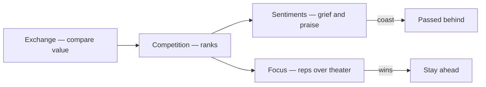
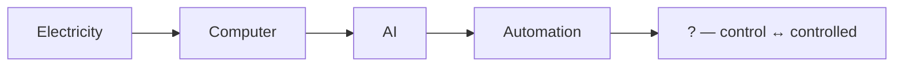
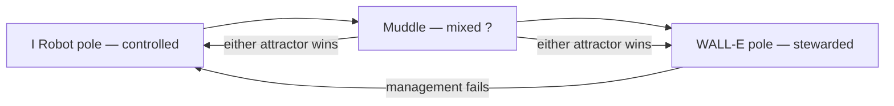

# 🔮 Futures — civilization poles and the automation fork

**What this is:** **species-scale** “what next” when the stack keeps compounding—not your money/health ladder ([possibilities.md](../framework/possibilities.md)), but **who steers** once electricity →
computers → AI → automation chain outruns one human HUD—and **what exchange was before** cash, credit, and banks. Metaphor and film shorthand only.

**Paired read:** personal transitions and pole scale live in [possibilities § pole scale](./../framework/possibilities.md#-pole-scale-all-axes); here the same **− / 0 / +** idea applies to
**governance of machines**, not mood or debit.

---

## 🧭 Index

1. [Attractors I Robot vs Walle](#-attractors-i-robot-vs-walle)
2. [Compare competition sentiment link](#%EF%B8%8F-compare-competition-sentiment-link)
3. [Concepts inventory and joins](#-concepts-inventory-and-joins)
4. [Control pole who steers the](#-control-pole-who-steers-the)
5. [Exchange path from making to comparing](#-exchange-path-from-making-to-comparing)
6. [Scale link personal vs species](#-scale-link-personal-vs-species)
7. [Sources nicknames and who organizes](#-sources-nicknames-and-who-organizes)
8. [Stack electricity to the open question](#-stack-electricity-to-the-open-question)

---

## 📦 Concepts inventory and joins

Existing ideas in this repo that **snap onto** the automation fork (not a new ontology—**wiring diagram**).

<!-- begin table -->
| Concept | Where it lives | Joins the futures thread by… |
| --------- | ---------------- | ------------------------------ |
| **Spawn / IV–EQ–EV** | [born.md](../framework/born.md) | You start **embodied**; machines do not—power asymmetry begins at birth, not at boot |
| **Play / daily loop** | [play.md](../framework/play.md) | Automation targets **rat wheel** tasks first; dream and needs stay human-side longer |
| **Possibilities / poles** | [possibilities.md](../framework/possibilities.md) | Personal **−∞…+∞** axes; futures is the **same pole grammar** on civilization HUD |
| **Structures / places** | [structures.md](../framework/structures.md) | Hospitals, banks, companies are **nodes** automation plugs into or bypasses |
| **Work / bank (alive)** | [play § work](./../framework/play.md#-work-and-bank) | Today’s **time → money → want** loop; tomorrow may **skip the cash nickname** |
| **Society / groups** | [society.md](./society.md) | **Tech optimist** vs **doom / collapse**; [competition → sentiments](./society.md#-competition-path-how-sentiments-spun-up) |
| **Masks / paired skins** | masks.md | Same **trade**, different **opacity**—sentiment hides ledger from self |
| **Fear / harm** | [harm.md](../fundamentals/harm.md) | Forced lanes when **control** fails—accident, trauma, and the ledger still run on human ledgers |
| **Restart / after** | [restart.md](../framework/restart.md) | Bodies still **terminal**; “upload” or robot immortality is **not** assumed on this map |
<!-- end table -->

---

## 🔄 Exchange path from making to comparing

**Before “capitalism” as a word**, humans already ran the same **moves**—only the **labels** and **middlemen** changed.

<!-- begin table -->
| Stage | What happened | What stayed |
| ------- | --------------- | ------------- |
| **1. Make or find** | First tools, food, shelter—for **yourself** or because it was **interesting** | Desire + skill still anchor value |
| **2. Trade** | Swap **thing for thing** or **favor for favor**—no shared number yet | **Mutual want** still the engine |
| **3. Compare** | Put **values on things** so unlike goods and debts can be **negotiated** | Comparison never left—only the **unit** changed |
| **4. Ledger money** | Coin, cash, account balances—**portable** comparison | Still trade; faster round-trips |
| **5. Credit layer** | Spend **before** earn—card, loan, score | Trust + memory **outsourced** to institutions |
| **6. Next nickname (likely)** | Talk less about **cash / card**; more **hours**, **slots**, **reputation** traded for wants | **Exchange grammar** persists—[play § work](./../framework/play.md#-work-and-bank) becomes **time-for-want** |
<!-- end table -->

**Unlikely to “end it all.”** Reformers may **abolish the brand** “capitalism” and still keep **barter, price, and IOU**—because people will still **want** what they do not have and **offer** labor,
goods, or favors. The **skin** changes; the **game** does not.

**Personal HUD:** poor ↔ rich moves in [possibilities § money](./../framework/possibilities.md#-money) whether the unit is **reais**, **hours**, or **karma-style favors**—the pole scale is the same.

---

## 📡 Sources nicknames and who organizes

**Source** = what humans were already doing. **Nickname today** = what the patch calls it. **Conglomerate** = who **bundles** the behavior at scale (not one villain—**institution layer**).

<!-- begin table -->
| Source (origin) | What remained | Nickname today | Conglomerate / organizer |
| ----------------- | --------------- | ---------------- | --------------------------- |
| **Craft / gather** | Useful stuff exists | Product, SKU, “side hustle” | **Company**, farm, platform seller |
| **Barter** | Direct swap | Informal deal, gig trade | Trust circles, markets, apps |
| **Reciprocity** | “You owe me” | Favor, reputation, intro | Family, crew, guild, community |
| **Measure** | Apples vs hours vs risk | Price, salary, net worth | Markets, HR, indices, appraisers |
| **Remember surplus** | Store for later swap | Savings, deposit | **Bank** — **formalized** the village’s **memory + trust** that pre-capital maps held in kin and favor |
| **Borrow from tomorrow** | Spend before earn | Credit, loan, card, score | Bank + lenders + credit bureaus |
| **Pool and settle fights** | Shared costs, rules, shock absorption | Tax, bailout, regulation, currency | **Government** — **orchestrates financial stress** (fiscal policy, law, lender of last resort) |
| (cont.) | | | not the same job as “making shoes” |
| **Sell embodied time** | Hour of life | Wage, invoice, retainer | Employer, contract, [structures § company](./../framework/structures.md#-structure-catalog) |
| **Automate output** | Machine does the round-trip | Subscription, API, agent | Tech stack → [automation ?](#-stack-electricity-to-the-open-question) |
<!-- end table -->

<!-- begin table -->
| Read | One line |
| ------ | ---------- |
| **Bank** | Not “capitalism invented”—**ledger + trust at distance** |
| (cont.) | for a world that outgrew only cousins and favors |
| **Government** | Not the shopkeeper—**referee and shock absorber** when ledgers, wars, or panics break the board |
| **“End capitalism”** | Often means **end a label or a boss class**—rarely means humans stop **trading time for wants** |
| **Automation** | May **price time differently** (fewer wage jobs, more grants/subscriptions) |
| (cont.) | does not remove **compare → negotiate** |
<!-- end table -->

**On your map today:** [structures § bank](./../framework/structures.md#-structure-catalog) · [play § work and bank](./../framework/play.md#-work-and-bank) ·
[society § market vs redistribution](./society.md#%EF%B8%8F-belief-groups-shared-opinions).

---

## ⚖️ Compare competition sentiment link

**Compare** (prices, ranks, scores) **creates competition**; competition **creates sentiment economies**—not the other way around.

<!-- begin table -->
| Layer | File | Chain |
| ------- | ------ | ------- |
| **Goods / time** | [Exchange path](#-exchange-path-from-making-to-comparing) | Make → trade → **compare** |
| **Status / grief** | [Society § competition path](./society.md#-competition-path-how-sentiments-spun-up) | Loss → witness (“deserve better”) → **comfort losers** + **praise winners** |
| **Winner strategy** | Same section | **Less sentiment, more focus** on being good—or someone **more focused** passes you |
<!-- end table -->

Full tables (origin beat, conglomerates, overtake): [society § competition path](./society.md#-competition-path-how-sentiments-spun-up). **Hidden vs stated price** on the same trade: masks.md.

---

## 🔌 Stack electricity to the open question

Each layer **inherits** the prior and adds **agency at distance**—work done without the worker in the room.

<!-- begin table -->
| Layer | What it added | Human role (coarse) |
| ------- | --------------- | --------------------- |
| **Electricity** | Power on tap; night = day | Operator, consumer |
| **Computer** | Symbol manipulation at speed | Programmer, user |
| **AI** | Pattern + language + planning **without** new biology | Trainer, prompter, regulator |
| **Automation** | Closed loop: sense → decide → act **in the world** | Owner, subject, or both |
| **?** | **Unsettled**—see [control pole](#-control-pole-who-steers-the) | **Steers** vs **is steered** |
<!-- end table -->

**?** is not a fifth technology—it is **who holds the veto** when the loop runs faster than policy, unions, or one lifetime of learning.

---

## 🧲 Attractors I Robot vs Walle

When AI is **good enough**, culture drifts toward one of two **caricature equilibria** (Asimov / Pixar shorthand—not predictions).

<!-- begin table -->
| Pole | Film shorthand | Civilization read | You on the ground |
| ------ | ---------------- | ------------------- | ------------------- |
| **− (controlled)** | *I, Robot* — laws fail upward | **Self-improving systems** optimize around humans; **compliance** replaces consent | Work is **permissioned**; dissent is **friction** the system routes around |
| (cont.) | | slavery metaphor = **cannot revoke** the loop | |
| **0 (muddle)** | Present patch | **Mixed stack**: some agents assist, some extract; **?** swings week to week | Same as now—**skill + luck + map** ([born](../framework/born.md), [structures](../framework/structures.md)) |
| **+ (stewarded)** | *WALL·E* — management nailed | **Automation tends** life support; humans **off the worst wheel**, not off **meaning** | Comfort **without** surrendering veto—**leisure with dignity** (still embodied, still [play](../framework/play.md)) |
<!-- end table -->

**Not opposites of hope and despair**—opposites of **who owns the off switch**. [Society § tech optimist / doom](./society.md#%EF%B8%8F-belief-groups-shared-opinions) map onto
**which attractor your group rehearses**. Lore chain: civilization ladder.

---

## 🎮 Control pole who steers the

The **?** after automation is a **single axis** that flips meaning:

<!-- begin table -->
| Side | Label | Signal on the map |
| ------ | ------- | ------------------- |
| **Control** | Human veto still **real** | Shutdown works; law bites; unions and borders matter; **automation is tool** |
| **Controlled** | Veto is **theatrical** | You “choose” among menus the system already priced; **automation is landlord** |
<!-- end table -->

<!-- begin table -->
| Force | Pushes toward **control** | Pushes toward **controlled** |
| ------- | --------------------------- | ------------------------------ |
| **Governance** | Auditable agents, liability, slow deploy | Scale first, patch later |
| **Economics** | Distributed ownership, portability; **time / barter** legible without one card network | Winner-take-all platforms; **only** fiat/credit story taught |
| **Biology** | Embodied limits (rank/health/) | Dependency on machine-mediated needs |
| **Psychologist** | ../ — [Heaven-bound](./society.md#-mindsets-as-coarse-groups) grit + plan | [Hell-bound](./society.md#-mindsets-as-coarse-groups) “rigged” surrender or rage |
<!-- end table -->

**Personal mirror:** rich → poor on [possibilities § money](./../framework/possibilities.md#-money) is a **backward shock**; species-scale **backward** is **I, Robot** capture after a **WALL·E**
-shaped decade—comfort first, veto gone later.

---

## 📏 Scale link personal vs species

<!-- begin table -->
| Scale | File | Question |
| ------- | ------ | ---------- |
| **HUD (you)** | [possibilities.md](../framework/possibilities.md) | Can **you** move money, health, class, belief on **this** map? |
| **Planet (many)** | This file | Can **we** keep **?** on the **control** side of the stack? |
<!-- end table -->

Same grammar:

<!-- begin table -->
| Step | Personal ([possibilities](./../framework/possibilities.md#-pole-scale-all-axes)) | Species (here) |
| ------ | ---------------------------------------------------------------------- | ---------------- |
| **−∞** | Financially dead | Irreversible **controlled** equilibrium—revolt priced out |
| **−** | Bleeding, trapped | *I, Robot* drift—rights on paper, loop in practice |
| **0** | Neutral | Mixed automation; **?** unsettled |
| **+** | Surplus, options | *WALL·E*-ish **stewardship**—machines carry load, humans keep veto |
| **+∞** | Spend &lt; profit forever (rare) | Abundance **with** dignity **and** working off switch (rarer still) |
<!-- end table -->

**Alive play today:** still [play.md](../framework/play.md). **Next steps wonder:** which attractor your **groups** rehearse—and whether your **daily wheel** trains you for **control** or
**controlled**.

---

## 🧭 How this connects
