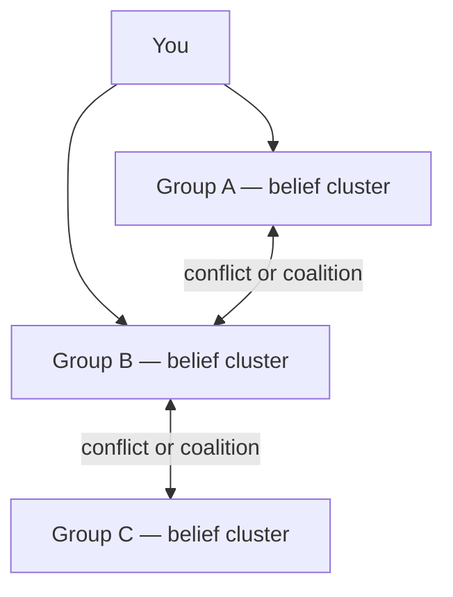
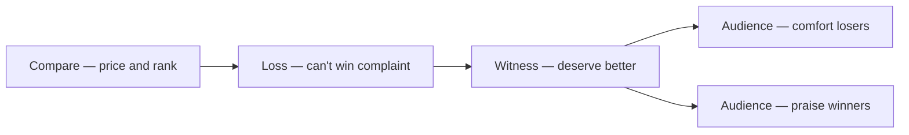
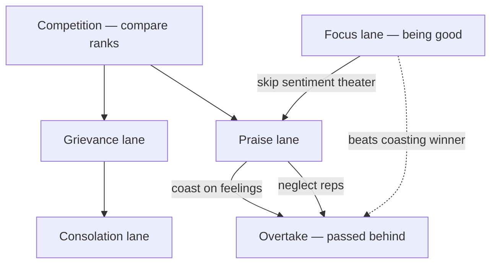
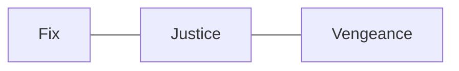

# 🌍 Society — groups, beliefs, and conflict

**What this is:** how **many players** sort into **groups** around shared opinions, how those groups **collide**, and how **you** respond without repeating [play.md](../framework/play.md) (daily
execution). Planet-scale teams: [structures.md](../framework/structures.md). Harm catalog: [fundamentals/harm.md](../fundamentals/harm.md).

**Group theory (light):** treat culture like **labeled sets**—each person carries **memberships**; groups overlap; edges are **coalition** or **conflict**. No one group owns the planet.

<!-- begin table -->
| Term | Read |
| ------ | ------ |
| **Member** | You **signal** belonging (dress, vote, feed, taboo) |
| **Script** | What “good members” are **supposed** to do |
| **Edge** | Another group is ally, enemy, or irrelevant |
| **Overlap** | Same person in church + union + nationalist—**tension** is normal |
<!-- end table -->

---

## 🗣️ Belief groups shared opinions

Not exhaustive—**major cultural HUD scripts** people bundle into identity. Maps differ; labels blur.

<!-- begin table -->
| Cluster | Shared opinion (caricature) | Typical script |
| --------- | ------------------------------ | ---------------- |
| **Traditional faith** | Moral order comes from **revealed or ancestral** law | Ritual, family role, sexual norm, afterlife hope |
| **Secular humanist** | Dignity without deity; **evidence and law** | Rights, reform, skepticism of holy veto |
| **Market meritocracy** | Worth ≈ **output × deal**; poverty = bad choices | Grind, brand, “earn your tier” |
| **Redistribution** | Luck and structure dominate; **tax the gap** | Solidarity, union, safety net politics |
| **Nationalist** | **Our people first**—border and story | Flag, language purity, enemy outside |
| **Cosmopolitan** | Border is **admin**; human first | Travel, mixed city, global cause |
| **Tech optimist** | Patch upgrade fixes society | Startup, AI, scale, move fast |
| **Doom / collapse** | System **cannot** reform in time | Prep, exit, irony, low fertility |
| **Default life-quest** | [Play § default course](./../framework/play.md#%EF%B8%8F-default-course-vs-side-quest) is **the** good life | Marry, kids, retire, judge the young |
| **Opt-out craft** | Prefab quest is **propaganda** | Art, solitude, childfree, slow lane |
| **Heaven-bound** | Match is **winnable enough** | Plan, routine, hope |
| **Hell-bound** | Match is **rigged**; force or quit | Grievance, weapon metaphor, sabotage |
| **Jelly / agnostic** | **Unknown** fairness | Drift, hedge, no stable wheel |
<!-- end table -->

**You are not one group.** Pick **which scripts you run** vs perform for an audience.

**Planet factions** (castle vs volcano lab) are the **macro** version of heaven/hell teams—[structures § hell vs heaven](./../framework/structures.md#%EF%B8%8F-hell-vs-heaven--two-teams-not-afterlife).
**Ping-pong rally** (hell serves, heaven defends): [structures § ping pong](./../framework/structures.md#-ping-pong-hell-serves-heaven-defends).

**Where group feelings came from:** [competition path § sentiments](#-competition-path-how-sentiments-spun-up) (loss → witness → two audiences). Species-scale cousins:
[futures § exchange](./futures.md#-exchange-path-from-making-to-comparing) (compare goods) · [futures § sources](./futures.md#-sources-nicknames-and-who-organizes).

---

## 🏁 Competition path how sentiments spun up

**Link to exchange:** once things have **prices** and **ranks**, players **compare**—comparison **is** competition. Sentiments are not random decoration; they are
**scripts that grew around who won and who lost**.

### 🌱 Origin beat (two-person seed)

<!-- begin table -->
| Beat | Who | What happened | What stayed |
| ------ | ----- | --------------- | ------------- |
| **1. Loss** | Someone **lost** something (game, mate, job, face) | **Complaint**—“I **can’t win**”; grief becomes **story** | Grievance as **membership ticket** ([hell-bound](#-mindsets-as-coarse-groups), [sabotagers](#-sabotagers)) |
| **2. Witness** | Someone else **felt sad** for how the loser **acted** | **Consolation**—“you **deserve** something better” | **Sympathy economy**—comfort without fixing the board |
| **3. Split audience** | Crowd forms **two lanes** | **Support losers** *and* **praise winners**—same match, two scripts | Politics, sports fandom, comment sections, HR praise |
<!-- end table -->

**Compare** (from [futures § exchange](./futures.md#-exchange-path-from-making-to-comparing)) feeds **loss**; **loss + witness** feeds **sentiment institutions** below.

### 🏆 Winners vs sentiment bandwidth

<!-- begin table -->
| Role | Sentiment load | Focus | Risk |
| ------ | ---------------- | ------- | ------ |
| **Loser (public)** | **High**—story, pity, solidarity | Re-run grievance or seek **fix** | Stuck in [hell-bound](#-mindsets-as-coarse-groups) script |
| **Winner (stable)** | **Lower**—less theater, more **being good** | **EV grind**—skill, reps, sleep, plan ([play § wheel](./../framework/play.md#-life-dream-and-rat-wheel)) | Coast on praise → **passed** by someone hungrier |
| **Winner (fragile)** | **High**—needs applause to feel real | **Wonderland** or brand, not reps | Someone **more focused** overtakes ([born § IV/EQ/EV](./../framework/born.md#-accept-spawn--ivs-eq-and-evs)) |
<!-- end table -->

**Read:** winners who **keep winning** often **spend less time in sentiment** and more in **boring practice**—not because they lack heart, but because **focus is the anti-lag stat**. If they stop
practicing and live on **sympathy or fame**, the leaderboard **still moves**—a sharper player takes the slot ([possibilities § class](./../framework/possibilities.md#-class--placement) ·
[play § earn](./../framework/play.md#%EF%B8%8F-default-course-vs-side-quest)).

Trait poles: psych § empathy (`sentimental` ↔ `detached`) · alive triage: emotional-routing.

### 🏷️ Sentiment sources — nicknames and who organizes

<!-- begin table -->
| Source (after competition exists) | What remained | Nickname today | Conglomerate / organizer |
| ----------------------------------- | --------------- | ---------------- | --------------------------- |
| **Grievance** | “Unfair match” | Victim narrative, rant, boycott | **Hell-bound** clusters, outrage media |
| **Consolation** | “You deserve better” | Pity, therapy speak, “thoughts and prayers” | Care institutions, comments, family script |
| **Solidarity** | Pool with losers | Union, mutual aid, redistribution politics | **Redistribution** vs **market meritocracy** clusters ([belief groups](#%EF%B8%8F-belief-groups-shared-opinions)) |
| **Praise** | Spotlight on winner | Promotion, medal, clout, “inspiring” | Schools, companies, influencer stack |
| **Discipline** | Winner **off** sentiment, on reps | “No excuses,” craft, streak | Coaches, managers, [heaven-bound](#-mindsets-as-coarse-groups) grind |
| **Overtake** | Hungrier player passes coasting winner | Demotion, replaced, forgotten champion | **Market** and **merit** patch—no referee saves idle +1 |
<!-- end table -->

<!-- begin table -->
| Pair | Tension |
| ------ | --------- |
| **Comfort losers** vs **praise winners** | Same game—**two** audience products; neither alone fixes a rigged ref |
| **Sentiment** vs **focus** | More **feeling** around the match; less **practice** on the winner side → **lag** |
| **Sympathy** vs **merit story** | Redistribution vs market meritocracy ([belief groups](#%EF%B8%8F-belief-groups-shared-opinions))—group echo of witness vs grind |
<!-- end table -->

**Not moral verdict**—**map read**. You can run consolation for others and **still** keep your own wheel on reps; groups pick which script they **sell** as identity.

**Same grammar, intimacy lane:** performed purity vs posted rate—masks § attention exchange.

---

## 🃏 Wonderland — solo delusion

**Wonderland:** story without HUD—you **believe you rolled a build you didn’t** (secret genius, destined winner).

**Antidote:** [born § accept](./../framework/born.md#-accept-spawn--ivs-eq-and-evs) → honest compare → dream you can build → [play § wheel](./../framework/play.md#-life-dream-and-rat-wheel). Not a
group problem—a **solo** misplay.

---

## ⚔️ Vengeance wheel — group conflict engine

1. A harms or insults B (or B’s group).
2. B’s group demands **payback**.
3. A’s group **hits back**.
4. Loop runs on **memory**, not permission.

Explains distributed cruelty **without** one villain CEO. **Forced** lanes: [harm.md](../fundamentals/harm.md).

---

## ⚖️ Fix, justice, vengeance

Group response spectrum after harm:

<!-- begin table -->
| Pole | Group behavior |
| ------ | ---------------- |
| **Fix** | Repair, compensate, change broken rules |
| **Justice** (middle) | Proportion, truth, **stop next wound** > feed loop |
| **Vengeance** | Retaliation as identity; escalation |
<!-- end table -->

**Norm:** seek **fix and justice** before **vengeance**—harm counts; retaliation-only often **expands** damage.

Personal mood poles: [play § personal poles](./../framework/play.md#-personal-poles-middles). Planet **fix/justice/vengeance** echo in governance narrative layer.

---

## 🔪 Sabotagers

Players who **concluded they cannot win** and **drag others down**—scams, cruelty, institutional pettiness. Joining them stacks debuffs. **Not every loss is your misplay**—bad spawn, corrupt refs,
saboteurs are real. Still: **don’t become them**—[harm § the loop](../fundamentals/harm.md#-the-loop--assess--post--reconcile).

---

## 🧠 Mindsets as coarse groups

<!-- begin table -->
| Membership | Belief | Play |
| ------------ | -------- | ------ |
| **Heaven-bound** | Can win **enough** | Grind, plan, wheel |
| **Hell-bound** | Cannot win | Nihilism, sabotage, complaint |
| **Jelly** | Unknown | No stable commitment |
<!-- end table -->

HUD settings—not proven afterlife ([restart.md](../framework/restart.md)). **Nudge:** one dream + one wheel turn for two weeks—update membership without Wonderland.

## 🧭 How this connects
