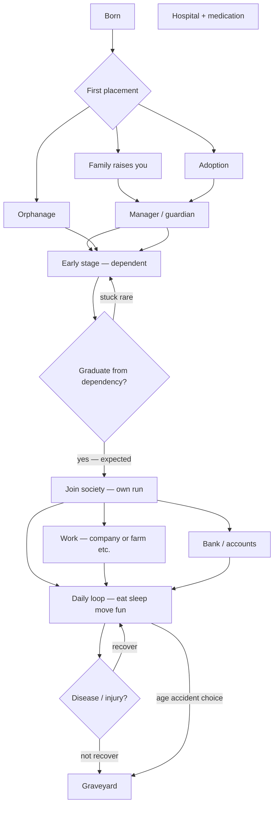
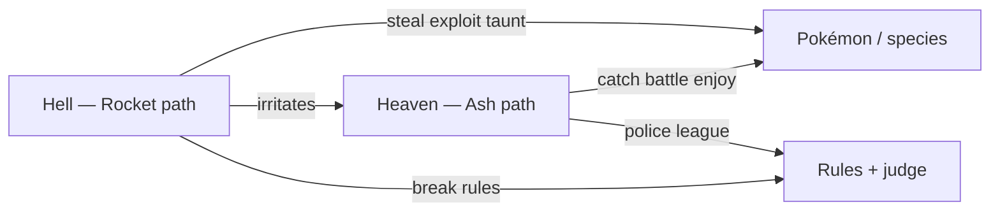
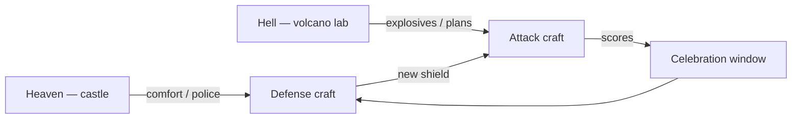
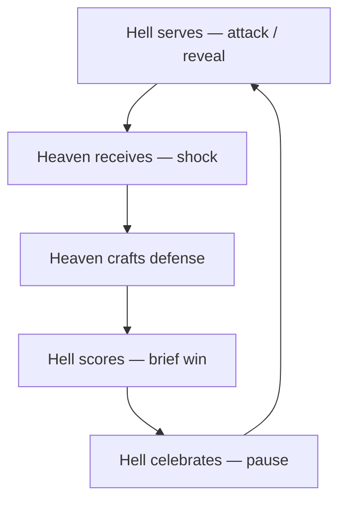

# 🏛️ Structures — places, borders, and planet match

**What this is:** named **places** and **gates** on the alive path, plus **planet-level** structure—species layer, heaven/hell teams, rules and judge, ping-pong rally. Every embodied run
**starts at born** and **ends at graveyard**; outside that window: [restart.md](./restart.md). **Metaphor only.**

**Framing:** not one global conspiracy—a **game structure**: many players, **pain enabled**, **human vs human** as the main UI. Church, state, and markets are **teams and stories** inside that
structure—not proof of a **good** governor.

---

## 🗺️ Alive path — born to graveyard

<!-- begin table -->
| Stage | Border | Read |
| ------- | -------- | ------ |
| **Born** | Entry | Lottery hands kit—detail in [born.md](./born.md) |
| **Early** | Dependency | Family, orphanage, or adoption; **orphanage is a stage**, not the whole run |
| **Graduate** | Expected exit | Everyone is **supposed** to eventually operate in society—formal or informal |
| **Independence** | Manager release | Past a point you **may** leave the former manager; need **income**, **housing**, **identity** |
| **Society** | Open map | Work, bank, relationships, health maintenance—[play.md](./play.md) |
| **Graveyard** | Terminal | Body stop; no undo—[restart.md](./restart.md) picks up after |
<!-- end table -->

**Not on this diagram:** abortion clinic (branch **before** or **instead of** full born path—policy and fiction vary); **transportation** (moves you between nodes); **graveyard** does not close the
story in [restart.md](./restart.md).

---

## 🏢 Structure catalog

<!-- begin table -->
| Structure | Role | Early stage? | Typical exit |
| ----------- | ------ | -------------- | -------------- |
| **Family home** | First manager, norms, resources | Yes | Independence or new manager (partner, self) |
| **Orphanage** | Collective care when no family slot | Yes | **Graduation** into society—staying forever is failure mode in the model |
| **Adoption** | New manager mid-run | Often yes | Same as family—eventually society |
| **Abortion clinic** | Termination / prevention node | N/A | Outside born→graveyard path for that sheet |
| **School / training** | EV grinding, credentials | Mixed | Feeds **company** eligibility |
| **Company** | Work structure—income, hierarchy, benefits | No | Layoff, quit, retirement → still **play** |
| **Farm company** | Food production lane—seasonal labor | No | Same as company; map-specific |
| **Transportation company** | Moves people/goods between places | No | Enables all other structures |
| **Bank** | Stores value, credit, debit—**formalized** pre-market trust/memory ([futures § sources](./../society/futures.md#-sources-nicknames-and-who-organizes)) | After dependency | **Required** for most independence plays |
| **Hospital** | Acute repair lane when **disease** or injury hits | Any | Back to **play** or forward to **graveyard** |
| **Pharmacy / medication** | Maintenance on chronic lanes | Any | Attached to hospital / health state |
| **Graveyard** | Body archive | Terminal | **Restart** queue—hypothesis only |
<!-- end table -->

---

## 🩺 Health lane on the map

**Disease** introduces **health problems** → **hospital** + **medication** → either return to [play.md](./play.md) loop or **graveyard**.

<!-- begin table -->
| Outcome | Path |
| --------- | ------ |
| Recover | Back to society loop |
| Chronic | Live with medication tax |
| Terminal | **Graveyard** |
<!-- end table -->

Trait poles for immunity and flags: rank/health/.

---

## 🔀 Transitions between states

Major **possibility moves** (rich↔poor, healthy↔sick, class, beliefs)—transitions and **how to achieve** each: [possibilities.md](./possibilities.md).

---

## 🧬 Species layer humans on top

Real **animal species** still exist. **Humans took control**—brains + weapons + institutions.

<!-- begin table -->
| Layer | Read |
| --- | --- |
| **Insects / small life** | Easiest to erase—whole clades live or die on **human whim**, often **random** |
| (cont.) | (pest control, agriculture, mood) |
| **Larger animals** | **Harder** to wipe out—size, habitat, law—but also **die fast** when targeted |
| (cont.) | (hunting, habitat loss, culling) |
| **Human society** | The **actual lobby**—almost all drama is **person to person**, not human vs lion day-to-day |
<!-- end table -->

Non-human life is **background resource and symbol**; **policy and revenge** are **intra-human**. Smaller-scale spawn metaphor:
[restart § insects](./restart.md#-insect-spawn-variance-optional-metaphor).

---

## ☁️ Hell vs heaven — two teams (not afterlife)

Same words as [society § mindsets](./../society/society.md#-mindsets-as-coarse-groups)—here as **planet factions**:

<!-- begin table -->
| Team | Who | Belief | Base |
| --- | --- | --- | --- |
| **Heaven** | Less aware or **choosing** optimism | Life is **fair**; I **deserve** this placement | **Castle**—comfort, police, security, “things work” |
| **Hell** | **Know too much** | Life is **rigged**; improvement needs **force** | **Volcano lab**—unhappy, planning, **crafting explosives** |
<!-- end table -->

**Hell (structure read):** the **unhappiest people who still want improvement**—they **see every shit move**, **plan responses**, build **strongest weapons**, and can **sabotage the planet** in
emergency (metaphor: even **stimulate earthquake**-class events if planning and leverage align).

**Heaven:** **relies on police, security, norms**—defense and **forgetting**. Example: **president → jail → president again**—population **forgets**, **new truth** is marketed. Not one team
worldwide—**many** heavens and hells **nested**.

**Quantities unknown.** Maybe **one** perfect attack could **nuke the planet**—only **spaceship + fuel storage** tier survives. Hell faction **AI-strategy read:** stay **a tiny bit ahead** of
heaven—not **too** good (unfair → instability) nor **behind** (hell loses the match). Operator parity: [restart § operator balance](./restart.md#%EF%B8%8F-operator-balance--life-game-owner).

---

## ⚡ Pokémon read — Ash, Rocket, and why trouble never ends

**Compact comparison** for the heaven/hell teams above—not canon Pokémon lore, **structure handle**. Franchise hub: play/nintendo/pokemon.md · mechanics/IVs.

<!-- begin table -->
| Pokémon shape | Life-structure read |
| --- | --- |
| **Ash (heaven)** | Walks the world **catching and battling** with **light worry**—story feels **fair** |
| (cont.) | growth is **adventure**, losses **reset** next episode |
| **Team Rocket (hell)** | **Always shows up**, causes trouble, **never fully disappears**—even when **not needed** for the plot |
| **Pokémon in balls** | **Non-human life** under human command—[species layer](#-species-layer-humans-on-top) |
| **Gym / league rules** | **What counts as fair fight**—needs a **judge** to **confirm** the result |
<!-- end table -->

### 🚀 Why Rocket keeps appearing

From heaven’s view Rocket is **noise**—“why don’t they vanish?” From the **match** view:

- **Hell must serve rounds** ([ping pong](#-ping-pong-hell-serves-heaven-defends))—without irritants, heaven **stops training** defense → **creative mode**.
- **Unknown layer (metaphor):** maybe the **boss created the whole category** (Pokémon / usable others)—**price of the toy** is **permanent irritation** of anyone who believes the world is
  **pure heaven**.
- **Karma read:** some **ledger debt** makes Rocket **structurally required**—not because victims earned it, but because **capture + command + battle** already opened the **slavery lane**; Rocket is
  the **recurring invoice**. Post margins: [harm § the loop](../fundamentals/harm.md#-the-loop--assess--post--reconcile).
- **Crackhead read:** like a **crackhead thief** who **steals the entire time and never gets caught**, while the other side is **always living a wonderful life and just trying not to lose to them**.
  From one view it
  is **great training** (keeps heaven sharp) — but it **doesn't really make sense** as a plot. The irritation is the point: the world *needs* an eternal thief to keep the "good life" from going flat.

### 📌 Capture and forced battle — hell manager energy

#### 🤔 Why go out, trap, and fight?

Heaven story: **partnership**, badges, **dream**. Hell read: **manager putting slaves to work**—the ball is a **cell**, the arena is **labor**, the kid with a cap is **middle management**.

Once humans **command non-humans to fight for sport**, the **same rule** can apply **human ↔ human**:

> Command others into combat → **you** can be **commanded** into combat against **other humans**.

That is the **symmetry** that keeps Rocket from being “random evil”—**mirrored coercion** in the structure. **Forced** lane: [harm.md](../fundamentals/harm.md).

### 📌 Pure heaven counterfactual

**Only-heaven planet:**

- Pokémon (and animals generally) **free**—not **owned**, not **ordered** into fights.
- Humans **observe, care, maybe coexist**—no league that **requires** violence to prove worth.

The moment you **normalize commanded fighting**, you **import hell’s job description**—someone **must** play Rocket, or the **books** do not balance.

### 📌 Rules, fair vs unfair, judge

**Rules** (law, league, treaty, taboo) **define** what heaven will call **fair**. **Judge** (court, ref, VAR, [harm § reconcile](../fundamentals/harm.md#-the-loop--assess--post--reconcile)) is
**mandatory** to **confirm** outcomes—otherwise every round is **he said / she said** and the [vengeance wheel](./../society/society.md#%EF%B8%8F-vengeance-wheel--group-conflict-engine) spins faster.

<!-- begin table -->
| Piece | Role |
| --- | --- |
| **Rules** | Boundary on **what moves are legal** |
| **Judge** | **Confirms** result—score stands or **rematch / penalty** |
| **No judge** | Hell serves **extra** rounds; heaven **cannot** close the book → [harm § reconcile](../fundamentals/harm.md#-the-loop--assess--post--reconcile) |
<!-- end table -->

Price the acts: [fair-game.md](../../justice/fair-game.md) · why the model breaks: [free-will.md](./free-will.md).

**Fair vs unfair (operator read):** hell **slightly** ahead is **matchable**; hell **dominates** or heaven **never feels threat** → **invite chaos** or **creative mode**—[restart § operator
balance](./restart.md#%EF%B8%8F-operator-balance--life-game-owner).

---

## 🏰 Castle vs volcano — war prep

<!-- begin table -->
| | Heaven | Hell |
| --- | --- | --- |
| **Mood** | Happy in the **castle** | Sad beside the **volcano** |
| **Peacetime** | Enjoy position | **Already prepared for worst** |
| **Wartime** | Scramble **perfect defense** | **First strike** already on the shelf |
<!-- end table -->

---

## 🏓 Ping pong hell serves heaven defends

**Default rally:**

- **Hell creates first**—attacks, exposes, leaks, weapons, scandal.
- **Heaven learns on contact**—meets hell in the news, court, or war room, then **crafts defense**.
- **Hell scores** → **celebration + rest window** → heaven **recovers** and builds **next shield**.

**They need each other.** If hell **wins outright**, **no heaven left**—bad for hell too → **psychological cancer**: factions **turn on each other** inside hell.

**Role swap:** if **heaven attacks** and **hell defends**, teams **effectively switched**—more rare. Default is **hell serves, heaven receives**—otherwise **no match** → **Minecraft creative mode**
(no stakes).

**Tennis rule:** you need **server and defender**. Defenders who **serve too much** get **invited to the other team**—political people **migrate** between camps.

**Inevitability:** **many people together + pain enabled** → this rally **happens** without a designer typing each move.

---

## ♟️ God and devil — the match the owner keeps

**Top of the tree:** the world organizes as a **ranking / tree graph**, and the **game owner is the manager** — probably the one who **created most of the characters**. Above the two teams sits this
owner, who keeps the match running.

The **devil and god** keep playing **life chess**:

- **God** wants to **protect his people**.
- **Devil** wants to **have fun sabotaging god's plan**.
- **God never kills the devil nor ends up with problems** — the devil is *above* it, enjoying the world **without the cost of being the political dude**. More like a
  **snake who charges for other people's mistakes**, while god keeps saying it will get better despite **never changing shit**.

**Read:** god is the **visible referee** (heaven's side); the devil is the **structurally required irritant** ([Rocket read](#-why-rocket-keeps-appearing)) — the owner keeps both, because the
**match needs both** ([ping pong](#-ping-pong-hell-serves-heaven-defends)). If god truly had power, why keep hell at all? — balance § god with real power.

## 🧭 How this connects
