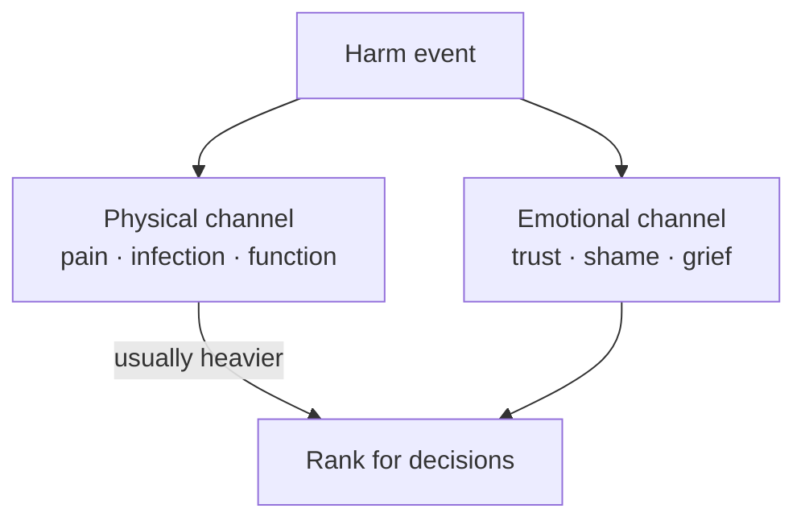

# 🧮 Life judgement — ranking harm

**What this is:** how to **weigh** bad outcomes when deciding, apologizing, or posting margins — not legal advice. **Two damage channels**, **how long it lasts**, and whether another person's body or
run was **non-recoverably** changed. Pairs with [fundamentals/harm.md](fundamentals/harm.md) (the loop), [fear-triage.md](fundamentals/fear-triage.md) (what's fixable), law-street-trust (proof
vs total cost).

---

## ⚖️ Two channels — emotional vs physical

<!-- begin table -->
| Channel | What it hits | Why it hurts | Typical fixability |
| --- | --- | --- | --- |
| **Emotional** | Trust, shame, grief, humiliation, betrayal *felt* | Story about you and others — identity, belonging | Often **partial or full** over years — therapy, new bonds, distance |
| **Physical** | Tissue, infection, pain nerves, organs, limbs | **Sensation** + health cascades + function | **Slower** — medicine helps; some damage **never** returns to baseline |
<!-- end table -->

**Default weight:** **physical ranks heavier** than emotional at the same duration tier. Emotional harm can be brutal — depression, ruined years — but the **body ledger** often has **harder floors**:
chronic pain, disability, lifelong meds, no regrow.

**Not a contest:** cheating can wreck someone emotionally *and* give them an STD. Stack both channels.

---

## ⏳ Duration — cure, maintenance, or forever

Split outcomes by **whether baseline can return**, not by how sad you feel the first week.

<!-- begin table -->
| Tier | Meaning | Examples |
| --- | --- | --- |
| **A — Full cure** | Known path back to “normal enough” | Many betrayals *without* body cost; clean-healing sprain; treated bacterial STI |
| **B — Managed chronic** | No erase, but **stable** with lifelong meds or routine | HIV on ART; HSV; diabetes; some nerve pain on pills |
| **C — Scar + tricks** | Body **different**; hacks not restoration | Malunited fracture; prosthetic limb; vision after laser — better, not original |
| **D — No real fix** | Permanent loss or dysfunction; **management only** | Amputation (no regrow); severe TBI; intractable pain; blindness |
| **E — Run ended** | Death — **no known cure** | [fear-triage § cure](fundamentals/fear-triage.md) · [hard-limit](fundamentals/hard-limit.md) **−∞** |
<!-- end table -->

**Medication forever** is tier **B**, not **A** — you are not “unchanged,” you are **maintained**. Still often better than **D**.

**Rule of thumb:** higher letter tier → **worse** when comparing same channel and same intent (accident vs forced).

---

## 🚫 Imposed on another — non-recoverable is worse

Most acts that **non-recoverably** change **another human** rank **above** the same damage done to yourself (voluntary) or by physics alone (accident).

<!-- begin table -->
| Lens | Question |
| --- | --- |
| **Recoverability for victim** | Can *they* get baseline back, or only manage? |
| **Agency** | Did someone **choose** to impose it? → forced stacks above accident |
| **Duration** | Tier **D** or **E** on their body or life → [harm § ledger](fundamentals/harm.md) large / infinite |
<!-- end table -->

You do not need a court to **rank** this for your own margins — see law-street-trust § total cost.

---

## 🧪 Paired examples (same neighborhood, different weight)

<!-- begin table -->
| Event | Emotional | Physical | Duration (victim) | Rough read |
| --- | --- | --- | --- | --- |
| **Learn partner cheated** | High — grief, humiliation | Low — unless disclosed risk ignored | Often **A–B** emotionally (scar remains) | Bad; mostly **trust** ledger |
| **Catch STD from undisclosed partner** | High — betrayal | **High** — infection, clinic, disclosure | **A–B** by bug — HIV **B** (heaviest), HPV often **A**, bacterial **A** | **Worse than cheating alone** — body + trust |
| **Clean broken bone** | Medium — fear, dependency | High — pain, rehab | Often **A–C** — may heal wrong | Physical pain + disability risk |
| **Lost limb** | High — identity, grief | **Very high** — pain, phantom, function | **D** — no regrow; prosthetic is **trick** | Among worst **survivable** physical tiers |
| **Assassination** | — (others grieve) | Total | **E** | **−∞** — victim's run ended |
<!-- end table -->

**Cheated vs STD:** knowing hurts; **carrying a lifelong infection** (or years of treatment) is **worse** on the **physical + duration** axes even when the emotional story is equally ugly.

**Broken bone vs lost limb:** both “physical,” but limb is **tier D** — no fix, only **adaptation**. Bone might land **A** or **C** depending on healing.

---

## 📖 How to use this (decisions, not rumination)

1. **Name both channels** — emotional-only vs body involved.
2. **Assign duration tier** — A through E for **each** channel that applies.
3. **Check victim** — if you caused **D/E** on another person, weight [harm.md](fundamentals/harm.md) and amends accordingly.
4. **Post one margin** — test, boundary, apology with restitution, safety gear — then reconcile.

Do not use this table to **minimize** emotional harm (“it's only feelings”). Use it to **not under-weight** body harm when guilt is invisible (private sex, “no proof”).

---

## 🔗 How this connects elsewhere

<!-- begin table -->
| Topic | Hub |
| --- | --- |
| Ledger postings (+/−, −∞) | [harm § the loop](fundamentals/harm.md#-the-loop--assess--post--reconcile) |
| Death / pain / trauma cure detail | [fear-triage § cure](fundamentals/fear-triage.md) · [hard-limit](fundamentals/hard-limit.md) |
| Law vs street vs personal cost | law-street-trust |
| Prize vs price in choices | decisions |
| Labelling a guess (prejudice) | [prejudice.md](./prejudice.md) |
| Justice vs vengeance | society § fix |
<!-- end table -->

---

## 🧭 How this connects
