# ⚔️ Hell vs heaven — the bridge

**What this is:** the infinite war between hell (sound village) and heaven (leaf village), connected by a bridge managed by the Uchiha and the tailed beasts — a two-edged sword. Pairs with
[structures.md](../../framework/structures.md) (hell vs heaven as two teams), [orchestrator.md](./orchestrator.md) (the village theater), [truco-hierarchy.md](./truco-hierarchy.md) (the card mapping),
and [monitoring.md](../../monitoring.md) (the watcher). **Metaphor only.**

## 🗺️ The war map

Every connection runs both ways — one arrow to **receive**, another to **provide**. The line runs from sound village (hell) to leaf village (heaven):

```text
sound village -> orochimaru -> kabuto -> shisui
<- itachi <- sasuke <- tailed beasts -> sakura
<- leaf village
```

```mermaid
flowchart LR
  subgraph hell["Hell — sound village"]
    sound["Sound village"]
    oro["Orochimaru"]
    kabuto["Kabuto"]
  end
  subgraph bridge["The bridge — Uchiha + tailed beasts"]
    shisui["Shisui"]
    itachi["Itachi"]
    sasuke["Sasuke"]
    bijuu["Tailed beasts"]
  end
  subgraph heaven["Heaven — leaf village"]
    sakura["Sakura"]
    leaf["Leaf village"]
  end
  watch["Byakugan — watch from afar"]

  sound -->|envies · manipulates| oro
  oro -->|trauma · ahead of time| sound
  oro -->|jutsus| kabuto
  kabuto -->|defends sound| oro
  kabuto -->|attacks| shisui
  shisui -->|strategy · persuasion| kabuto
  shisui -->|orders| itachi
  itachi -->|memory · keeps the wheel| shisui
  itachi -->|pressure| sasuke
  sasuke -->|revenge speeches| itachi
  sasuke -->|host · executor| bijuu
  bijuu -->|power · shields the village| sasuke
  bijuu -->|two-edged sword| sakura
  sakura -->|heals · holds the line| bijuu
  sakura -->|defends| leaf
  leaf -->|safety · long life| sakura
  watch -.->|watch the war| shisui
  watch -.->|watch the war| itachi
  watch -.->|watch the war| sasuke
```



The bridge sits between hell and heaven, managed by those with the Uchiha alongside the tailed beasts. It behaves like a two-edged sword — attacking both Sasuke and Sakura.

## ⚔️ Hell vs heaven

- **Hell (sound)** is stronger but lasts shorter — it forces people into traumatic situations as early as possible, always ahead of its time, shortening life expectancy.
- **Heaven (leaf)** operates more into protecting people's minds so they live a longer, safe life — but some still pursue power while in heaven, which invites chaos.

Both sides have their strengths. It's like hell is stronger but shorter; to be so strong it must be ahead of its time.

## 🕊️ Karma rules

- Destroy the **leaf village** → you attract **bad karma**.
- Destroy the **sound village** → you put an end to **karma**.
- Someone makes the **first mistake in heaven** → someone from hell goes after **vengeance**.
- Those who execute the vengeance tend to move **from heaven to hell**.

The sound village envies the leaf village and tries to manipulate it — a war begins whenever sound finds a weakness.

## 🌉 The bridge

- **Sakura** defends the leaf village; **Kabuto** defends the sound village.
- **Those with Byakugan** watch the war from far distance.
- **The Uchiha** orchestrate the tailed beasts to keep some balance between hell and heaven — they work as the **strategy provider**.
- **The tailed beasts** protect the village from the Uchiha's own plans — immune even to their genjutsu.
- **Sasuke** tends to be the most stressed — somewhat the weakest Uchiha, not welcomed in the village. To continue, someone must provide a new Uchiha to help him be less
  stressed: pretty much like Sakura's child helping with Sasuke's job — keeping the sound village entertained while not damaging much the leaf village.
- It's an infinite loop: people create a bridge between hell and heaven; it sometimes gets a bit too old and needs repair.
- **Sasuke holds the bridge** — the representative of the village, the one standing between hell and heaven.
- **Naruto thinks he's the best but can't even win against the weakest Uchiha** — if they truly won, there would be no need for ninja.
- **Hell is masked as the sound village** — people are aware it can attack at any moment, so they keep training those in the village to be stronger than those in hell.

## 🏙️ Villages as countries

The anime is crafted around groups, pretty much like countries in the world. Each village is managed by its own leader — the Hokage, like a mayor — and each village has its unique principles.

**The devil is an unknown village** — no one knows where it is, how to beat it, or who works for it. Still, they keep studying how to do such a thing. In practice, people could simply live their
lives. But then
the Hokage starts to complain: the devil was too good, Shisui didn't obey him — "I must put everyone in the village under my command to fulfill this infinite psychological hole in my brain."

Cross-refs: [odd-people.md](./odd-people.md) (the obedience pyramid) and [infinite-loop.md](./infinite-loop.md) (the karma loop).

## 🪞 The Uchiha mirror

They keep pursuing some kind of fair battle to train each other. Still, during the war, they lost again — even reviving other people and joining all teams. It's like
failing to understand that the Uchiha are too overpowered: they are like a mirror, any attack in a mirror goes back to you, so it's pretty much impossible.

It works great as some kind of checkers game: everyone wants to attack Madara, so they all join together and fall into a genjutsu. Quite odd part of marriage and parenthood — some miracle separates
the war and this new generation of kids. Cross-refs: [infinite-loop.md](./infinite-loop.md) (the reproduction machinery) and [odd-people.md](./odd-people.md) (the same boss with upgrades).

## 🔚 Close

Ending up with hell is not feasible — it means no one can commit any mistake: no cheating, no violence, no gun, everyone must be perfectly equal. Given this is impossible, there's always competition
between people. In
order to establish peace, it's easier to separate between those who are in the leaf village, representing heaven, and those who are in the sound village, representing hell — each side with its own
strength.
