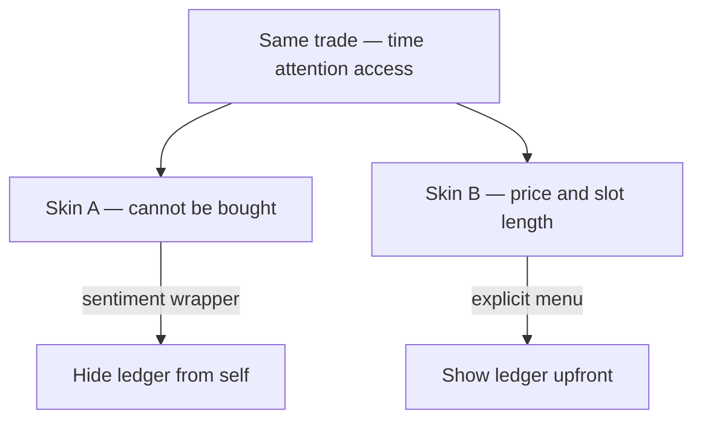
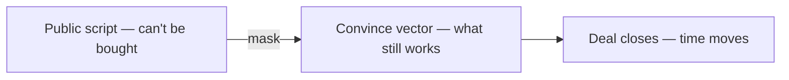

# 🎭 Masks — paired opposites and hidden price tags

**What this is:** recurring **opposite skins** on the **same underlying trade**—one player **states** value and duration; another **performs** that money or favors “cannot
buy” what they still **sell** under sentiment. Map read only—not a moral scorecard. Exchange grammar: futures § exchange. Sentiment audiences: society § competition.

**Metaphor only.** Applies to **any** role where **attention, time, access, or status** is scarce—not one gender, one country, or one job label.

---

## 🧭 Index

1. [Attention exchange performed purity vs posted rate](#-attention-exchange-performed-purity-vs-posted-rate)
2. [Convince vector what still moves them](#-convince-vector-what-still-moves-them)
3. [More pairs on the map](#%EF%B8%8F-more-pairs-on-the-map)
4. [Paired opposites same trade different skin](#-paired-opposites-same-trade-different-skin)
5. [Self-protection why the mask exists](#%EF%B8%8F-self-protection-why-the-mask-exists)
6. [Object as alibi power worn not owned](#-object-as-alibi-power-worn-not-owned)

---

## 🎭 Paired opposites same trade different skin

Many life lanes are **one market, two costumes**:

<!-- begin table -->
| Skin A (masked) | Skin B (upfront) | What is **actually** exchanged |
| ----------------- | ------------------ | -------------------------------- |
| **Performed purity** | **Posted rate + duration** | **Attention / access** for money, favors, status, or safety |
| “Not about money” | Invoice, retainer, hourly | **Time** and **risk** |
| “True love / fate” | Filters, checklist, prenup | **Mate selection** criteria |
| “Passion project” | Salary line | **Labor** |
| “Friendship favor” | Consulting day rate | **Skill hours** |
| “Art not for sale” | Commission sheet | **Creative output** |
| “Principle” | Lobby spend | **Policy** outcome |
<!-- end table -->

**Read:** B is often **less sentimental** because the **ledger is already on the HUD**—no need to narrate purity. A is not “deeper”—usually **more theater** around the same compare → negotiate move
(futures § compare). Lore: Truman Show · [aquarium](media/aquarium.md).

---

## 💱 Attention exchange performed purity vs posted rate

**Common pairing** on maps where **romance, status, and money** overlap (your example: two **women’s** scripts—generalize to anyone running the lane).

<!-- begin table -->
| Pole | What they **say** | What the map **shows** |
| ------ | ------------------- | ------------------------ |
| **Performed purity** | “No money can buy **my** attention”—romance, destiny, taste | Still a **convince vector**—gift, clout, drama, exclusivity, relocation, “real connection” |
| **Posted rate** | Quiet **value** and **time box**—hour, evening, tier, boundary | Trade is **legible**; less story, more **contract** |
<!-- end table -->

<!-- begin table -->
| Dimension | Performed purity | Posted rate |
| ----------- | ------------------ | ------------- |
| **Ledger** | Hidden—even from self | On the table |
| **Sentiment** | High—story protects both sides from “transaction” | Lower—deal language |
| **Negotiation** | Oblique—tests, jealousy, “prove it” | Direct—menu, deposit, no-show policy |
| **Risk** | Misread signals; “I thought it was real” | Misread **terms**; clearer dispute surface |
<!-- end table -->

**End state:** **both** can be convinced—difference is **packaging**, not “one has no price.” A uses **mask** so neither party has to say **attention is for sale**; B says it **out loud** and trades
**shame** for **clarity**.

**Pair stage on default course:** play § default course — Pair · body/presentation moves: possibilities § body.

---

## 🧲 Convince vector what still moves them

**Convince vector** = what **actually** flips a “no” to a “yes” after the script plays out.

<!-- begin table -->
| If the skin is… | Stated veto | Likely vector anyway |
| ----------------- | ------------- | ---------------------- |
| Performed purity | “Money doesn’t matter” | Status, beauty, novelty, safety, revenge, boredom, clock (biological or career) |
| Posted rate | “Only at my rate” | **Meeting** rate + rules—still finite |
| Merit grind | “Just work hard” | Luck, patron, map, health (born § IV/EQ/EV) |
| Hell-bound | “Can’t win” | Spectacle, belonging, sabotage (society § sabotagers) |
<!-- end table -->

**Winner-side echo:** less sentiment, more **focus**—society § winners vs sentiment. **Coast on mask** (fame, purity brand) → someone **more focused** passes you.

---

## 🛡️ Self-protection why the mask exists

Mask is not only **deception toward others**—it is **armor for the seller** so they do not have to **see** the trade.

<!-- begin table -->
| Protects from… | By… |
| ---------------- | ----- |
| Seeing self as “for sale” | Calling it love, taste, principle |
| Seeing buyer as “paying” | Calling it generosity, fate, “he pursued” |
| Shame on the ledger | **Sentiment** thicker than the contract |
| Regret after yes | “I was moved”—not “I chose the menu” |
<!-- end table -->

**Despite what they say:** many opposites are **the same behavior** with **different opacity**. The upfront pole is often **kinder to planning**; the masked pole is **kinder to identity**—until the
bill arrives as story instead of receipt.

Trait read: `sentimental` vs `detached`—psych § empathy. Day-on-fire: emotional-routing.

---

## 🎒 Object as alibi power worn not owned

A **superpower object** (amulet, item, artifact) lets others accept wins **without acknowledging prep, grind, or intelligence**—"he wins because of the Puzzle" is simpler than arguing capacity. The
object is the **alibi**: it externalizes competence so nobody has to look at the ledger of work.

- **Decoration, not source** — the item dramatizes what the person already is; losing it is like being without a shirt, still yourself. The person was shaped for years (same choices, similar lines of
  thought); the object is redundant to who they are.
- **The alibi hides the mask** — a trophy amulet is a *self-protection* device in object form: it lets the holder avoid seeing their own trade as grind, and lets the audience avoid admitting uneven
  capacity.
- **Credibility is frame-bound** — if the object is exclusive (only Kaiba plays the Blue-Eyes), faking the owner is implausible; *who believes you?* Identity, not paper, is the real protection.

**Deep read:** object powers + the binding that makes them hard to steal: [balance.md § powers](framework/balance.md#-powers-object-vs-person). **Lore:** Yu-Gi-Oh! (Millennium Items as mask) ·
Pokémon (badges as proof-of-progress).

---

## 🗺️ More pairs on the map

Same **mask / upfront** grammar elsewhere—spot the **shared trade**:

<!-- begin table -->
| Domain | Masked pole | Upfront pole | Shared trade |
| -------- | ------------- | -------------- | -------------- |
| **Work** | “Family” startup sweat | Hourly / equity grant | Labor for upside |
| **Politics** | “People’s will” | Budget line item | Power for spend |
| **Faith** | “Calling” | Tithe, service schedule | Belonging + labor |
| **Fitness** | “Lifestyle” | Program, coach fee | Body change for money/time |
| **Online** | “Authentic creator” | Sponsor rate card | Attention for brand |
| **Conflict** | “Justice” | Settlement sum | Peace for payment |
<!-- end table -->

**Civilization stack:** compare goods → competition → sentiments—futures § compare → sentiment. **Personal poles** (mood, risk): play § personal poles.

**Antidote (solo):** born § accept → name your **real menu** (what you sell, what you buy, what convinces you) → play § wheel. **Antidote (group):** don’t confuse **comfort losers** with
**fixing the ref**—society § competition.

---

## 🧭 How this connects
