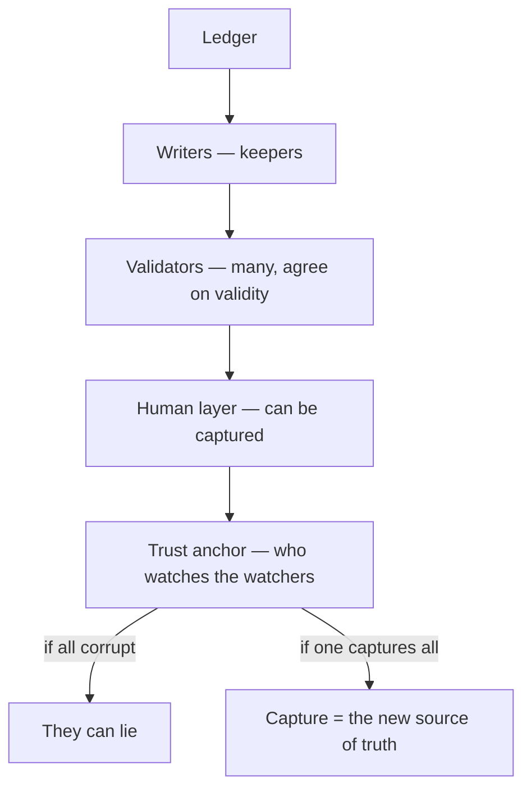

# 📒 Ledgers — consensus, and who validates

**What this is:** who **writes** the record, who **agrees** it's true, and who **validates** the validators. Every
ledger — a bank's, a court's, a blockchain's — bottoms out in a **human layer that can be captured**. Pairs with
[fair-game.md](../justice/fair-game.md), [futures.md](futures.md), and [society.md](society.md). **Metaphor only.**

---

## 🧾 The three ledgers — not one

The same act can score differently on each book:

<!-- begin table -->
| Ledger | Keeper | Trust depends on |
| --- | --- | --- |
| **Law** | State, courts | The record the state keeps |
| **Street / social** | Crowd, neighbors | What people remember and repeat |
| **Personal** | You, your own record | Your own memory + conscience |
<!-- end table -->

A ledger is only as good as **who maintains it** — and every book has a keeper. The **bank** is the formalized
version of the village's memory + trust ([futures.md § exchange path](futures.md)): one keeper, one ledger, everyone
trusts it — until the keeper goes bad.

---

## ⛓️ Distributed ledger (blockchain)

Blockchain is somewhat the **perfect database**:

- **Hard to add data** — no single writer can just append.
- **Shared with lots of people** — it's like a **voting system**: many agree whether the current log is valid.
- **When agreed, everyone gets a copy** and continues from there.
- It's like a **library book** with information that is *internationally agreed* — the record is public and
  self-propagating.

The trick isn't the cryptography — it's that **the validators are many, not one**.

---

## 🔄 Rollback by consensus

The same consent that **adds** data can **undo** it:

> If everyone decides to roll back, it's quite possible — the same way they agreed to add a new entry, they can agree
> to undo it.

Consensus is **reversible**. A distributed ledger doesn't protect against an agreed lie — it protects against a
**single** liar.

---

## 🗳️ Voting paradox

The real-world mirror is the **election**:

- You go to election day and **trust the government will say who won**.
- As long as the result **looks similar to your expectations**, it's valid.
- Say there are **10 possible winners** — an **11th appearing is quite odd**.
- If they distribute **99% of the votes** among the expected 10, **most people keep trusting** the system.

The system stays trusted while the result stays **recognizable**. It's not correctness that keeps the trust — it's
**consistency with expectation**.

---

## 🧑‍🤝‍🧑 Trust anchor — who validates the validators

So who validates such a thing? The government is **managed by people**:

> Let's say there are **100 officers**. If all of them become corrupt for some reason, they can **lie about the
> results** — and nothing on the ledger stops them, because the ledger's validation layer *is* them.

Every system — bank, court, blockchain, election — bottoms out in a **human layer that can be captured**. The
"perfect database" is only as perfect as the **people running the consensus**.

## 🧭 How this connects

<!-- begin table -->
| Topic | Hub |
| --- | --- |
| The trial that prices the act | [fair-game.md](../justice/fair-game.md) |
| Bank as memory + trust | [futures.md § exchange path](futures.md) |
| Belief groups that keep trust | [society.md](society.md) |
| Forged records and provenance | [evidence.md](../justice/evidence.md) |
| The monitored mesh as a ledger | [monitoring.md § localhost/OS](../monitoring.md) |
<!-- end table -->
